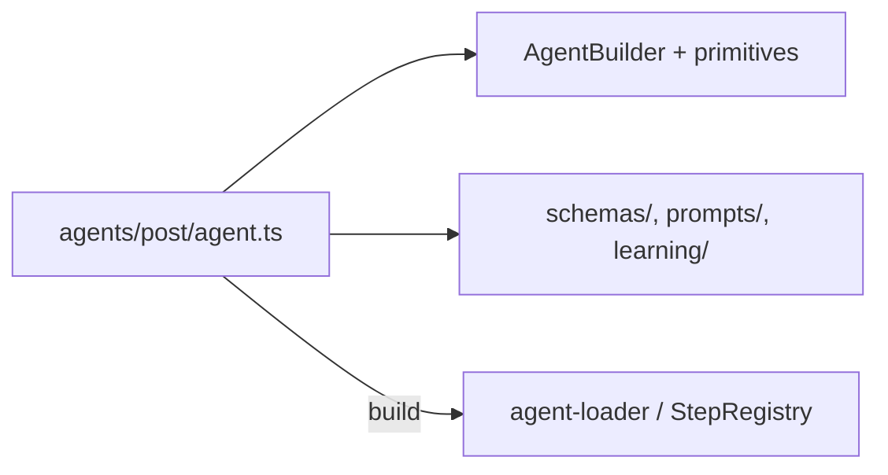
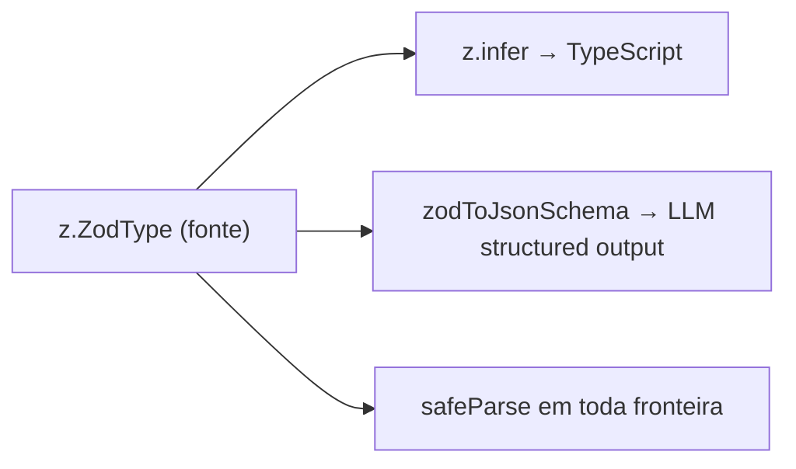
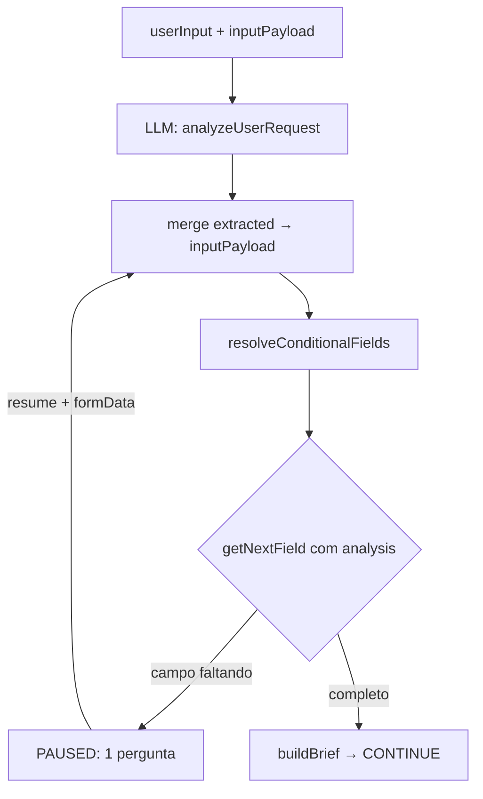
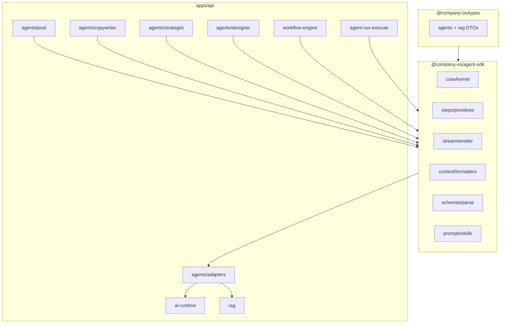
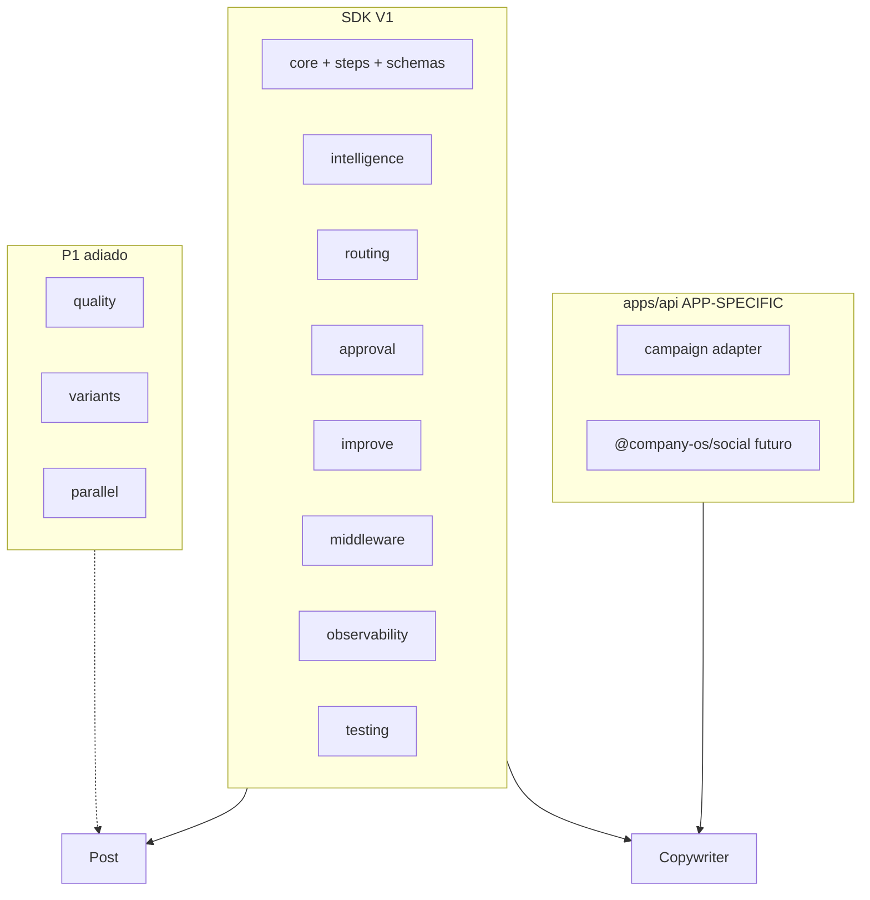

# Plano: SDK de Agentes Blister (`@company-os/agent-sdk`)

## Contexto atual

O runtime de agentes hoje vive **embutido** em `[apps/api/src/agents/runtime/](apps/api/src/agents/runtime/)` com lógica duplicada entre kernel (Trigger/inline) e Nest (`StepContextFactory`). Apenas o agente `**post`** tem steps custom registrados; `copywriter`, `strategist` e `designer` caem nos handlers genéricos do kernel — ignorando prompts e validação Zod já escritos.

```mermaid
flowchart LR
  subgraph today [Hoje]
    API[apps/api/agents]
    Kernel[kernel/]
    AIRuntime[ai-runtime/]
    RAG[rag/]
    API --> Kernel
    Kernel -.->|contextPackBuilder: null| RAG
    Kernel --> AIRuntime
  end

  subgraph target [Alvo]
    SDK["@company-os/agent-sdk"]
    Adapters[apps/api adapters]
    Agents[agents/post|copywriter|...]
    SDK --> Adapters
    Agents --> SDK
    Adapters --> AIRuntime2[ai-runtime]
    Adapters --> RAG2[rag]
  end
```


**Decisões do usuário:** pacote **único** `@company-os/agent-sdk`; escopo **agent-focused** — AI/RAG permanecem em `apps/api`, expostos via **interfaces** na SDK.

**Decisão adicional (iteração):** cada agente **continua com seu próprio arquivo** (`agents/<id>/agent.ts`) — esse arquivo é o ponto de entrada onde o agente é **inicializado, configurado e registrado** usando a SDK (`AgentBuilder`). Prompts, schemas e learning ficam em arquivos auxiliares; a orquestração vive no arquivo do agente.

**Decisão adicional (iteração):** a SDK deve ter módulo de **análise inteligente do pedido** — a IA lê a mensagem livre do usuário, extrai campos estruturados, decide o caminho do workflow, **pula perguntas já respondidas** no input e **só pergunta o que falta** (ou gera perguntas dinâmicas quando necessário).

**Decisão adicional (iteração):** **todo input e output da IA deve ser totalmente tipado com Zod** — schemas Zod são a fonte de verdade; JSON Schema para o LLM é **derivado** automaticamente; validação obrigatória em toda fronteira (run input, step output, resposta LLM, brief, review).

**Decisão adicional (iteração):** módulo `testing/` com **`AgentTestHarness`** — agentes e kernel testados in-memory com mocks injetados; `expect(output).toMatchSchema(zod)` em todo teste de agente.

**Revisão final (iteração):** V1 congelada. **Agent-first:** kernel + builder + steps → migrar copywriter primeiro → demais agentes → só então intelligence/routing. Billing **fora** da SDK (`UsageReporter`). `createPauseStep` **substitui** módulo `approval/`. Tools + Memory + Checkpoints na V1.

**Avaliação pós-revisão:** Arquitetura 9.5/10 · Overengineering ~3/10 · Pronta para implementação.

---

## Escopo V1 congelado

### Camadas da SDK

```text
CORE (V1)              EXTENSIONS (V1)         APP (apps/api)           P1 adiado
────────────────       ────────────────        ──────────────           ──────────
core/ (+checkpoints)   tools/                  campaign adapter         improve/
steps/ (+pause,tool)   memory/                 platform/@company-os/social  quality/
schemas/               routing/                credits (UsageReporter)  variants/
stream/                learning/               compliance→step custom   parallel/
context/               usage/ (reporter)                                render/
testing/
middleware/
observability/
intelligence/          ← implementar APÓS migrar agentes base
```

### V1 congelada — lista definitiva

| Módulo | Conteúdo |
|--------|----------|
| **core** | `executeRun`, `AgentBuilder` + version, `AgentRegistry`, **checkpoints** |
| **steps** | `createLlmCallStep` (retry, cache), `createValidationStep`, `createRetrieveContextStep`, `createImageGenerationStep`, **`createPauseStep`**, **`createToolStep`** |
| **schemas** | `defineAgentSchemas`, `parseLlmJson`, `toMatchSchema` |
| **stream** | `BlockEmitter`, event publishers |
| **context** | `buildStepContext`, formatters, `PromptComposer` |
| **testing** | `AgentTestHarness`, `StepTestHarness` |
| **middleware** | `.beforeRun()`, `.afterRun()`, `.beforeStep()`, `.afterStep()` |
| **observability** | `TelemetryProvider`, **`RunSnapshot`** |
| **usage** | **`UsageReporter`** — reporta tokens/images/costUsd; **não** créditos |
| **tools** | `ToolRegistry`, `.withTools()`, `createToolStep` — loop LLM→tool→LLM |
| **memory** | **`MemoryProvider`** interface (pode começar vazia) — learning ≠ memory |
| **learning** | `LearningSerializerRegistry` — feedback aprovado → RAG |
| **routing** | `addRouting`, `createConditionalStep` |
| **intelligence** | `baseRequestAnalysisSchema`, `createAdaptiveBriefStep` — **após agentes** |

### Removido da SDK (APP-SPECIFIC)

| Módulo | Motivo | Onde vive |
|--------|--------|-----------|
| **`platform/`** | Rede social é domínio, não runtime | `apps/api` ou `@company-os/social` |
| **`campaign/`** | Feature Blister | `apps/api/src/agents/adapters/campaign-context.adapter.ts` |
| **`compliance/`** | Regras por agente/cliente | step custom no agente |
| **`scaffold/`** | DX/CLI | P2 |

### Adiado P1

`improve/`, `quality/refineLoop`, `variants/`, `parallel/`, `render/`, `output/export`, `locale/`, `safety/`, `multimodal/`, `macros/`, `scaffold/`

### Adicionado à V1 (gap identificado na revisão)

**Middleware** — evita módulo por cross-cutting concern:

```typescript
AgentBuilder.create({ id: 'post', version: '1.0.0' })
  .beforeRun(authMiddleware)
  .afterRun(persistSnapshotMiddleware)
  .beforeStep(logMiddleware)
  .beforeStep(metricsMiddleware)
```

**Retry explícito** em `createLlmCallStep`:

```typescript
retry: { maxAttempts: 3, backoff: 'exponential', retryOn: ['parse_error', 'rate_limit'] }
```

**Cache** — `CacheProvider` injetável + `cacheKey(ctx)` opcional no step LLM.

**Observability + RunSnapshot** — congela por run: `input`, `contextPack`, `prompts`, `stepOutputs`, `llmResponses` — via `RunStore.saveSnapshot()` para debug.

**Versionamento** — `AgentBuilder.create({ id: 'post', version: '1.0.0' })`; `AgentRun.agentVersion` persistido.

**UsageReporter** (substitui `billing/CreditDebitor` na SDK):

```typescript
interface UsageReporter {
  reportUsage(event: {
    runId: string; stepKey: string; agentId: string;
    tokensInput: number; tokensOutput: number;
    imagesGenerated?: number; costUsd: number;
  }): Promise<void>
}
// apps/api adapter → CreditService.debit() — Blister decide créditos/limite/assinatura
```

**createPauseStep** (substitui módulo `approval/`):

```typescript
createPauseStep({
  pauseType: 'design_plan_approval' | 'form' | 'confirm' | 'file_upload',
  until: (ctx) => ctx.inputPayload.approved === true,
  getFormSchema?: (ctx) => pauseFormSchema,
  previewBlock?: 'planning' | 'output' | 'formQuestion',
})
// Casos: approval, onboarding, coleta de dados, confirmação, upload
```

**Tools** (V1, simples):

```typescript
AgentBuilder.create('post').withTools([searchBrandTool, crmTool])
createToolStep({ tools, maxRounds: 5 })  // LLM → tool → LLM loop
```

**MemoryProvider** (≠ learning):

```typescript
interface MemoryProvider {
  recall?(query: string, ctx: MemoryContext): Promise<MemoryChunk[]>
  // learning = "usuário aprovou X" | memory = "usuário prefere CTA curto"
}
```

**Checkpoints** (complementa RunSnapshot):

```typescript
// Após cada step concluído com sucesso:
await checkpoint({ runId, stepKey, state: { inputPayload, previousStepsOutput } })
// Em falha no step 3 → resumeFromCheckpoint(step2) sem refazer step 1-2
```

---

## Padrão por agente: arquivo próprio + SDK

Cada agente mantém **1 arquivo principal** que declara tudo via SDK. O runtime Blister só importa esse arquivo no boot.

```
agents/<id>/
├── agent.ts              # ← ARQUIVO PRINCIPAL (inicializa, contexto, steps, learning)
├── schemas/              # Zod + JSON Schema específicos
├── prompts/              # builders de prompt específicos
├── learning/             # feedback-handler (referenciado no agent.ts)
└── assets.ts / onboarding.ts / ...  # só quando o agente precisa
```

**O que vai no `agent.ts` (via SDK):**

1. **Inicializar** — `AgentBuilder.create({ id: 'post', version: '1.0.0' })`
2. **Metadados** — label, description, capabilities, input/output schemas
3. **Contexto** — `.withContext({ brandBrain, agentLearning, campaign })` por step ou global
4. **Skills** — `.withSkills([...])`
5. **Steps** — `.addStep(...)` usando primitives da SDK ou step custom
6. **Learning** — `.withLearning(serializePostLearning)`
7. **Build** — `.build()` exporta `{ definition, steps }` pronto para registro

`**index.ts` vira re-export fino** (opcional) — só reexporta de `agent.ts` para compatibilidade.




---

## Arquitetura da SDK

### Pacote

```
packages/agent-sdk/
├── package.json          # name: @company-os/agent-sdk
├── tsconfig.json         # extends packages/configs/tsconfig.nest.json
├── src/
│   ├── index.ts          # barrel público
│   ├── core/             # kernel, types, agent definition builder
│   ├── steps/            # step primitives + registry
│   ├── context/          # step context builder + formatters (interfaces)
│   ├── stream/           # BlockEmitter + event publisher interfaces
│   ├── prompts/          # skill loader, prompt composer
│   ├── schemas/          # JSON parse, Zod helpers, normalizers genéricos
│   ├── usage/            # UsageReporter — tokens/cost, sem créditos
│   ├── tools/            # ToolRegistry + createToolStep (V1)
│   ├── memory/           # MemoryProvider interface (V1)
│   ├── learning/         # LearningSerializerRegistry
│   ├── clarification/    # onboarding multi-pause (1 campo por vez)
│   ├── intelligence/     # análise do pedido, brief adaptativo (V1)
│   ├── routing/          # workflow condicional (V1)
│   # createPauseStep em steps/ — sem módulo approval/
│   ├── improve/          # regenerate com feedback (V1)
│   ├── middleware/       # beforeRun/afterStep hooks (V1)
│   ├── observability/    # TelemetryProvider + RunSnapshot (V1)
│   └── testing/          # AgentTestHarness, stubs, fixtures, matchers Zod (V1, Fase 2)
│   # APP-SPECIFIC → apps/api: campaign, platform (@company-os/social)
│   # P1 adiado: quality/, variants/, parallel/, render/, scaffold/
```

### Princípio de design


| Camada                               | Na SDK                 | Em `apps/api` (adapters)                                                        |
| ------------------------------------ | ---------------------- | ------------------------------------------------------------------------------- |
| Kernel + loop de steps               | Sim                    | —                                                                               |
| Block protocol + emitter             | Sim                    | `AgentRunBlockService` implementa interface                                     |
| Step primitives                      | Sim                    | —                                                                               |
| Análise inteligente do pedido        | Sim                    | Campos/enums específicos por agente                                             |
| Prompt/skill composition             | Sim                    | —                                                                               |
| `defineAgentSchemas` + validação Zod | Sim                    | Schemas Zod por agente em `agents/<id>/schemas/`; JSON derivado automaticamente |
| `LlmProvider`, `ImageProvider`       | Interface + tipos      | `AiRuntimeService`, `trigger-providers`                                         |
| `ContextPackBuilder`                 | Interface + formatters | `ContextPackService` adapter                                                    |
| `AssetResolver`                      | Interface              | S3 presigned em `trigger-providers`                                             |
| `UsageReporter`                      | Interface              | `credit-debit.helper` + Prisma em apps/api adapter                              |
| `MemoryProvider`                     | Interface              | RAG/preferences adapter em apps/api (pode ser no-op inicial)                  |
| `EventPublisher`                     | Interface + factories  | HTTP/InProcess publishers                                                       |
| Prisma persistence                   | Interface `RunStore`   | Implementação Nest                                                              |


A SDK **não importa** Prisma, Nest nem Trigger — só tipos e contratos de `@company-os/types` + **Zod v4** como dependência direta.

---

## Princípio: Zod como fonte de verdade (tipagem total)

Hoje os agentes mantêm **duplicata** Zod + JSON Schema manual (ex.: `[post/schemas/output.schema.ts](apps/api/src/agents/post/schemas/output.schema.ts)`). A SDK elimina isso: **define uma vez em Zod, deriva o resto**.




### Fronteiras de validação obrigatórias


| Fronteira           | Quando                                          | Falha                                                       |
| ------------------- | ----------------------------------------------- | ----------------------------------------------------------- |
| **Run input**       | `POST /agents/:id/run`                          | `400` — input inválido antes de enfileirar                  |
| **Resume formData** | `POST /runs/:id/resume`                         | `400` — resposta de formulário inválida                     |
| **LLM response**    | Todo `createLlmCallStep` / `analyzeUserRequest` | Step `FAILED` + retry se configurado                        |
| **Step output**     | Ao retornar `CONTINUE` de qualquer step         | Step `FAILED` se output não bate com `outputSchema` do step |
| **Agent output**    | `validate_output` + persistência final          | Run `FAILED` ou review bloqueado                            |
| **Review edit**     | `PATCH /runs/:id/output`                        | `400` — `reviewSchema.safeParse`                            |


### Padrão de schema por agente (pós-migração)

```typescript
// agents/post/schemas/output.schema.ts
import { defineAgentSchemas } from '@company-os/agent-sdk';

export const postSchemas = defineAgentSchemas({
  input: z.object({ userInput: z.string().min(5).max(1000) }),
  output: z.object({ slides: z.array(...), caption: z.string(), ... }),
  llmOutput: z.object({ ... }),      // contrato da resposta da IA
  review: z.object({ ... }),        // edição pelo usuário
  designPlan: z.object({ ... }),    // contrato de step intermediário
});

// Tipos inferidos — zero duplicação
export type PostInput = typeof postSchemas.infer.input;
export type PostOutput = typeof postSchemas.infer.output;
export type PostLlmOutput = typeof postSchemas.infer.llmOutput;

// JSON Schema para LLM — derivado
export const postLlmOutputJsonSchema = postSchemas.json.llmOutput;
```

### Steps tipados com generics

```typescript
createLlmCallStep<PostLlmOutput>({
  outputSchema: postSchemas.zod.llmOutput,  // obrigatório — não aceita JSON Schema solto
  // retorno do executor é PostLlmOutput, não Record<string, unknown>
})

createAdaptiveBriefStep<PostBrief>({
  analysisSchema: postRequestAnalysisSchema, // estende baseRequestAnalysisSchema
  buildBrief: (answers): PostBrief => ...,
})
```

### `AgentBuilder` aceita só Zod

```typescript
AgentBuilder.create('post')
  .input(postSchemas.zod.input)           // substitui .inputSchema({ type: 'object', ... })
  .output(postSchemas.zod.output)         // substitui .outputSchema(postOutputSchema)
  .review(postSchemas.zod.review)         // opcional
```

O `.build()` gera automaticamente `inputSchema` / `outputSchema` JSON para catálogo e UI a partir do Zod.

---

## Módulos da SDK (funcionalidades)

### 1. `core` — Kernel, AgentBuilder e definição de agentes

**Extrair de:** `[agent-execution.kernel.ts](apps/api/src/agents/runtime/kernel/agent-execution.kernel.ts)`, `[types.ts](apps/api/src/agents/runtime/kernel/types.ts)`, `[agent-loader.ts](apps/api/src/agents/runtime/kernel/agent-loader.ts)`

**API pública — `AgentBuilder` (uso principal em cada `agent.ts`):**

```typescript
// Arquivo do agente: agents/<id>/agent.ts
export const postAgent = AgentBuilder.create('post')
  .label('Criar post')
  .description('Cria posts para redes sociais em HTML+CSS usando a identidade da marca')
  .input(postSchemas.zod.input)
  .output(postSchemas.zod.output)
  .review(postSchemas.zod.review)
  .capabilities(['text', 'html', 'structured_output'])
  .withSkills(POST_AGENT_SKILL_IDS)
  .withLearning({ serialize: serializePostLearning, extractInsights: extractLearningInsights })

  // Contexto RAG — global default + override por step
  .withContext({
    includeBrandBrain: true,
    includeAgentLearning: true,
    includeCampaignContext: true,
  })

  .addStep('retrieve_context', {
    label: 'Buscar contexto',
    type: 'preparation',
    run: createRetrieveContextStep(),
  })
  .addStep('collect_brief', {
    label: 'Entender o pedido',
    type: 'clarification',
    run: createClarificationStep({ fields: POST_ONBOARDING_FIELDS, buildBrief: buildPostBrief }),
  })
  .addStep('plan_design', {
    label: 'Planejar o design',
    type: 'llm_call',
    config: { maxTokens: 4096, temperature: 0.35 },
    run: createLlmCallStep({ /* prompts + schema */ }),
  })
  // ... demais steps
  .build();

// Exporta definition + step executors para o loader
export const { definition: postAgentDefinition, steps: postStepExecutors } = postAgent;
```

**API auxiliar:**

```typescript
// Atalho funcional (equivalente ao builder)
defineAgent({ agentId, label, steps, inputSchema, outputSchema, skills?, context?, learning? })

// Execução (runtime Blister)
executeRun(deps: AgentRuntimeDeps, params: ExecuteRunParams): Promise<RunResult>

// Registry global (boot da API)
AgentRegistry.register(postAgent)
AgentRegistry.get(agentId)
```

`**AgentBuilder` expõe métodos fluentes:**


| Método                                          | Função                                        |
| ----------------------------------------------- | --------------------------------------------- |
| `.create(agentId)`                              | Inicia builder                                |
| `.label()` / `.description()`                   | Metadados UI                                  |
| `.input(zod)` / `.output(zod)` / `.review(zod)` | Contratos Zod (JSON Schema derivado no build) |
| `.capabilities()`                               | Tags do catálogo                              |
| `.withContext(opts)`                            | Default RAG (brand, learning, campaign)       |
| `.withSkills(ids)`                              | Skills injetadas em steps `llm_call`          |
| `.withLearning(handler)`                        | Registra no `LearningSerializerRegistry`      |
| `.addStep(key, { label, type, config?, run })`  | Step + executor (primitive ou custom)         |
| `.build()`                                      | `{ definition, steps, learning? }`            |


`**AgentRuntimeDeps`** (todas interfaces):

- `runStore: RunStore` — CRUD de run/steps (abstrai Prisma)
- `contextPackBuilder: ContextPackBuilder | null`
- `llmProvider: LlmProvider | null`
- `imageProvider: ImageProvider | null`
- `eventPublisher: EventPublisher`
- `blocks: BlockStore`
- `usageReporter: UsageReporter | null`
- `assetResolver?: AssetResolver`
- `stepRegistry: StepRegistry`
- `stubMode?: boolean`

**Melhorias embutidas:**

- Unificar `StepContextFactory` (Nest) e `buildStepContext` (kernel) em **um único** `buildStepContext()` na SDK
- Remover `llmComplete` órfão do factory Nest — steps usam `deps.llmProvider` via `StepExecutorDeps`

---

### 2. `steps` — Primitives reutilizáveis

Factory functions que retornam `CustomStepExecutor`, eliminando boilerplate nos agentes:


| Primitive                                                      | Origem                                 | Uso                                                                              |
| -------------------------------------------------------------- | -------------------------------------- | -------------------------------------------------------------------------------- |
| `createRetrieveContextStep(opts?)`                             | `post/steps/retrieve-context.step.ts`  | Emite bloco `searching`, retorna chunk count                                     |
| `createLlmCallStep<T>({ outputSchema: z.ZodType<T>, ... })`    | kernel genérico + post steps           | LLM com structured output; **parse + safeParse obrigatório**; retorno tipado `T` |
| `createImageGenerationStep({ promptKey })`                     | kernel `image_generation`              | Lê prompt de step anterior                                                       |
| `createValidationStep({ zodSchema, onInvalid? })`              | post/copywriter validate               | Validação Zod real (hoje kernel só retorna `{ validated: true }`)                |
| `createClarificationStep({ fields, buildBrief })`              | `post/onboarding.ts` + `collect-brief` | Human-in-the-loop 1 campo/pausa (sem análise de input)                           |
| `createAdaptiveBriefStep({ fields, enrichments, buildBrief })` | novo — `intelligence/`                 | Análise LLM do `userInput` + clarificação adaptativa                             |
| `createAnalyzeRequestStep({ inputKey, fields })`               | novo — `intelligence/`                 | Só análise; útil quando análise e clarificação são steps separados               |
| `createPauseStep({ pauseType, until, getFormSchema })`       | `approve-design-plan` + `collect-brief` | Pausa genérica: approval, onboarding, confirm, upload                            |
| `createOutputStep()`                                           | kernel `output`                        | Retorna outputs anteriores                                                       |


`**StepRegistry`:**

```typescript
const registry = new StepRegistry()
registry.register('post', { retrieve_context: createRetrieveContextStep(), ... })
// ou
registry.registerExecutor('post:plan_design', planDesignStep)
```

Substitui `[custom-steps.ts](apps/api/src/agents/runtime/kernel/custom-steps.ts)` — cada `agents/<id>/agent.ts` exporta `steps` via `.build()`; o boot agrega com `AgentRegistry.registerFromFolder()` ou imports explícitos.

---

### 3. `context` — Marca + RAG formatting

**Extrair de:** `[step-context.builder.ts](apps/api/src/agents/runtime/kernel/step-context.builder.ts)`, `[post/prompts/brand-context.format.ts](apps/api/src/agents/post/prompts/brand-context.format.ts)`, formatters do kernel (`buildSystemPrompt`)

**API:**

```typescript
buildStepContext(deps, params): Promise<StepExecutionContext>
formatBrandProfile(profile): string
formatContextPack(pack, opts?): string
formatAllowedContextSources(pack): string  // post-specific helper, mas genérico o suficiente
composePromptContext({ brand, pack, brief?, skills? }): PromptContext
```

**Interface `ContextPackBuilder`** (implementada em `apps/api`):

```typescript
interface ContextPackBuilder {
  buildPack(params: ContextPackQuery): Promise<ContextPack>
}
```

Adapter Blister: wrap de `[ContextPackService](apps/api/src/rag/context-pack.service.ts)` — **corrige o gap** `contextPackBuilder: null` em `[workflow-engine.service.ts](apps/api/src/agents/runtime/workflow-engine.service.ts)` e `[agent-run-execute.ts](apps/api/trigger/agent-run-execute.ts)`.

---

### 4. `stream` — BlockEmitter + eventos

**Extrair de:** `[block-emitter.ts](apps/api/src/agents/runtime/kernel/block-emitter.ts)`, `[run-event.publisher.ts](apps/api/src/agents/runtime/kernel/run-event.publisher.ts)`

Mantém API fluente existente (`openMessage`, `thinking`, `searching`, `planning`, `formQuestion`, `output`, `working`, `error`).

Exporta também factories de eventos (`createRunStartedEvent`, etc.) e interfaces `EventPublisher`, `BlockStore`.

**Opcional fase 2:** exportar reducer types compatíveis com `[agent-block-reducer.ts](apps/web/src/core/modules/agents/utils/agent-block-reducer.ts)` — web continua usando `@company-os/types`; SDK não move código React.

---

### 5. `prompts` — Skills e composição

**Extrair de:** `[agent-skills.loader.ts](apps/api/src/agents/runtime/kernel/agent-skills.loader.ts)`

**API:**

```typescript
loadSkill(agentId, skillId, basePaths?): AgentSkillDefinition | null
formatSkillsForPrompt(skills): string
PromptComposer.create()
  .withBrand(profile)
  .withContext(pack)
  .withSkills(skills)
  .withBrief(brief)
  .withUserInput(input)
  .build(): { system: string; user: string }
```

Torna `basePaths` configurável (hoje hardcoded para `apps/api/src/agents/`).

---

### 6. `schemas` — Contratos Zod, parse e validação (módulo central de tipagem)

**Extrair de:** utilitários em `[generate-post.step.ts](apps/api/src/agents/post/steps/generate-post.step.ts)`, padrão dual Zod+JSON em todos os `agents/*/schemas/`

**Regra:** nenhum step que chama IA aceita `Record<string, unknown>` como contrato final — sempre `z.ZodType<T>`.

**API pública:**

```typescript
// Factory para agentes — elimina duplicação Zod/JSON
defineAgentSchemas<TInput, TOutput, TLlm, TReview>(schemas: {
  input: z.ZodType<TInput>;
  output: z.ZodType<TOutput>;
  llmOutput?: z.ZodType<TLlm>;
  review?: z.ZodType<TReview>;
  [stepKey: string]: z.ZodType;  // schemas intermediários (designPlan, imagePrompt...)
}): {
  zod: typeof schemas;
  infer: { input: TInput; output: TOutput; llmOutput: TLlm; ... };
  json: Record<string, Record<string, unknown>>;  // derivado para LLM + catálogo
}

// Parse resiliente pós-LLM (já tipado)
parseLlmJson<T>(content: string, schema: z.ZodType<T>, opts?: {
  maxAttempts?: number;
  repair?: (raw: unknown) => unknown;
  onRetry?: (attempt: number, error: z.ZodError) => void;
}): { success: true; data: T } | { success: false; error: z.ZodError; raw: unknown }

// Validadores reutilizáveis
createValidator<T>(schema: z.ZodType<T>): {
  parse: (input: unknown) => T;
  safeParse: (input: unknown) => z.SafeParseReturnType<unknown, T>;
  assert: (input: unknown) => asserts input is T;
}

// Derivação JSON Schema (para structured output do provider)
zodToJsonSchema(schema: z.ZodType): Record<string, unknown>

// Normalização pré-parse (aliases PT/EN, enums inválidos)
createNormalizer<T>(schema: z.ZodType<T>, rules: NormalizerRules): (raw: unknown) => unknown

// Validação de step output antes de persistir
validateStepOutput<T>(schema: z.ZodType<T>, output: unknown): StepValidationResult<T>

// Validação de formData no resume (clarificação)
validateFormAnswer(field: ClarificationField, value: unknown): z.SafeParseReturnType<unknown, unknown>
```

**Schemas built-in da SDK (Zod, não opcionais):**


| Schema                          | Uso                                                         |
| ------------------------------- | ----------------------------------------------------------- |
| `baseRequestAnalysisSchema`     | Contrato base de análise — agentes estendem com `.extend()` |
| `extractedFieldSchema`          | Extração por campo (`value`, `confidence`, `evidence`)      |
| `defineRequestAnalysisSchema()` | Factory para schema de análise por agente                   |
| `clarificationAnswerZod`        | Respostas de formulário por `ClarificationFieldKind`        |
| `stepMetadataZod`               | tokens, model, creditCost em `StepResult`                   |
| `enrichmentFieldZod`            | Definição de campos enriquecidos no brief                   |


**Fluxo em `createLlmCallStep`:**

1. `zodToJsonSchema(outputSchema)` → enviado ao `LlmProvider.complete()`
2. Resposta bruta → `parseLlmJson(content, outputSchema)`
3. Se falha após retries → `StepResult { type: 'FAILED', error: formatZodError(...) }`
4. Se sucesso → `StepResult { type: 'CONTINUE', output: data }` onde `data: T`

**Migração dos schemas dos agentes:**

Remover JSON Schema manual duplicado. Cada `agents/<id>/schemas/` passa a usar `defineAgentSchemas()`:


| Agente       | Schemas Zod                                        |
| ------------ | -------------------------------------------------- |
| `post`       | input, output, llmOutput, review, designPlan       |
| `copywriter` | input, output, llmOutput, review                   |
| `strategist` | input, output, llmOutput                           |
| `designer`   | input, output, imagePrompt (sub-schema), llmOutput |


Normalizers específicos (ex. `design-plan.normalize.ts`) viram `repair` no `parseLlmJson` ou `createNormalizer` encadeado antes do `safeParse`.

---

### 7. `usage` — Reporte de uso (não billing)

A SDK **não conhece créditos**. Reporta métricas; Blister decide cobrança.

```typescript
interface UsageReporter {
  reportUsage(event: {
    runId: string
    stepKey: string
    agentId: string
    companyId: string
    tokensInput: number
    tokensOutput: number
    imagesGenerated?: number
    costUsd: number
    model?: string
  }): Promise<void>
}
```

Adapter em `apps/api`: `usage-reporter.adapter.ts` → `CreditService.debit()` + saldo pré-run no `WorkflowEngine` (fora da SDK).

---

### 8. `learning` — Feedback → RAG

**Extrair padrão de:** `[post/learning/feedback-handler.ts](apps/api/src/agents/post/learning/feedback-handler.ts)`, `[copywriter/learning/feedback-handler.ts](apps/api/src/agents/copywriter/learning/feedback-handler.ts)`

```typescript
LearningSerializerRegistry.register(agentId, { serialize, extractInsights })
LearningSerializerRegistry.serialize(agentId, output, feedback): string
```

`apps/api` usa registry no `[agent-run-review.service.ts](apps/api/src/agents/runtime/agent-run-review.service.ts)` em vez do serializer genérico JSON.

---

### 9. `clarification` — Onboarding multi-pausa

**Extrair de:** `[post/onboarding.ts](apps/api/src/agents/post/onboarding.ts)`

```typescript
defineClarificationFlow<TBrief>({ fields: ClarificationField[], buildBrief })
getNextField(accumulated, fields): ClarificationField | null
mergeFormData(payload, formData): Record<string, unknown>
resolveConditionalFields(answers, fields): ClarificationField[]  // ex.: slidesCount só se carousel
```

Reutilizável por qualquer agente que precise coletar brief antes do LLM.

---

### 10. `intelligence` — Análise inteligente do pedido (contrato explícito)

**Problema hoje:** o post agent pergunta rede, formato e objetivo **sempre**, mesmo quando o usuário já informou tudo na mensagem inicial (`userInput`). O `collect_brief` só olha `inputPayload` — não parseia o texto livre. Sem schema base, cada agente reinventaria `intent`, `confidence`, `missingFields`.

**Exemplo de input rico:**

> "Post de awareness para LinkedIn (se testar rede alternativa): Confeitaria da Paola como negócio familiar história de empreendedorismo feminino, tom profissional mas caloroso"

**Comportamento esperado da SDK:**


| Extraído do input                          | Ação                                                                         |
| ------------------------------------------ | ---------------------------------------------------------------------------- |
| `objective: awareness`                     | Pula pergunta de objetivo                                                    |
| `socialNetwork: linkedin`                  | Pula pergunta de rede                                                        |
| `tone: profissional mas caloroso`          | Vai para `enrichedBrief` (não é campo de formulário)                         |
| `postFormat` ausente                       | **Mantém** pergunta de formato                                               |
| `slidesCount` ausente + formato indefinido | Pergunta só depois de saber o formato                                        |
| "se testar rede alternativa"               | `confidence: medium` → pode confirmar com pergunta opcional ou seguir direto |


#### Contrato em camadas (Zod)

A SDK expõe **3 camadas** composáveis — agentes só estendem a camada 2:

```typescript
// ── Camada 1: extração por campo (reutilizável em qualquer agente) ──
export const extractedFieldSchema = z.object({
  value: z.unknown(),
  confidence: z.enum(['high', 'medium', 'low']),
  evidence: z.string(),  // trecho do input que justifica
});

export type ExtractedField = z.infer<typeof extractedFieldSchema>;

// ── Camada 2: schema BASE — todo agente herda (não reinventar) ──
export const suggestedPathSchema = z.enum(['quick', 'full', 'clarify']);
export type SuggestedPath = z.infer<typeof suggestedPathSchema>;

export const baseRequestAnalysisSchema = z.object({
  /** O que o usuário quer, em uma frase */
  intent: z.string(),
  /** Confiança global da análise (0–1) */
  confidence: z.number().min(0).max(1),
  /** Nomes dos campos obrigatórios que ainda faltam */
  missingFields: z.array(z.string()),
  /** Branch sugerido do workflow — consumido por routing/ */
  suggestedPath: suggestedPathSchema,
  /** Raciocínio da IA — exibido no bloco thinking (opcional na UI) */
  reasoning: z.string(),
  /** Campos extraídos com confidence por campo */
  extracted: z.record(z.string(), extractedFieldSchema),
  /** Campos que NÃO precisam ser perguntados (já resolvidos) */
  skippedFieldNames: z.array(z.string()),
  /** Tom, temas, ângulo narrativo — não são campos de formulário */
  enrichedBrief: z.record(z.string(), z.unknown()),
  /** Perguntas dinâmicas geradas pela IA quando o schema estático não cobre */
  dynamicQuestions: z.array(clarificationFieldSchema).optional(),
});

export type BaseRequestAnalysis = z.infer<typeof baseRequestAnalysisSchema>;

// ── Camada 3: extensão por agente ──
export function defineRequestAnalysisSchema<T extends z.ZodRawShape>(extension: T) {
  return baseRequestAnalysisSchema.extend(extension);
}

// Inferência do tipo completo
export type AgentRequestAnalysis<T extends z.ZodRawShape> =
  z.infer<ReturnType<typeof defineRequestAnalysisSchema<T>>>;
```

**Exemplo — post agent estende o base:**

```typescript
// agents/post/schemas/analysis.schema.ts
import { defineRequestAnalysisSchema } from '@company-os/agent-sdk';

export const postRequestAnalysisSchema = defineRequestAnalysisSchema({
  socialNetwork: z.enum(['instagram', 'facebook', 'linkedin', 'tiktok']).optional(),
  postFormat: z.enum(['single', 'carousel']).optional(),
  objective: z.enum(['sell', 'engage', 'promo', 'awareness']).optional(),
  contentType: z.enum(['post', 'story', 'reel']).optional(),
});

export type PostRequestAnalysis = z.infer<typeof postRequestAnalysisSchema>;

// JSON Schema para LLM — derivado automaticamente
export const postRequestAnalysisJsonSchema = zodToJsonSchema(postRequestAnalysisSchema);
```

**Exemplo — copywriter (extensão mínima):**

```typescript
export const copywriterRequestAnalysisSchema = defineRequestAnalysisSchema({
  platform: z.enum(['instagram', 'facebook', 'linkedin', 'tiktok']).optional(),
  copyLength: z.enum(['short', 'medium', 'long']).optional(),
});
```

**Regras do contrato:**

1. `createAnalyzeRequestStep` e `createAdaptiveBriefStep` **exigem** `analysisSchema` que estende `baseRequestAnalysisSchema` (validado em runtime com `.safeParse` + check de shape)
2. `missingFields` do base + `extracted` devem estar **sincronizados** — helper `normalizeAnalysisResult()` na SDK garante consistência pós-LLM
3. `suggestedPath` alimenta `routing/` — `quick` = pular steps opcionais; `clarify` = forçar perguntas; `full` = workflow completo
4. `enrichedBrief` é **sempre** `Record<string, unknown>` no base; agentes tipam enrichments via `enrichmentFieldSchema` na config do step

#### API dos steps

```typescript
// Step standalone — roda ANTES da clarificação
createAnalyzeRequestStep<TAnalysis>({
  inputKey: 'userInput',
  analysisSchema: postRequestAnalysisSchema,  // obrigatório — estende base
  fields: ClarificationField[],
  enrichments?: EnrichmentField[],
  minConfidenceToSkip?: 'high' | 'medium',
  emitThinkingBlock?: boolean,
}): CustomStepExecutor

// Step combinado — análise + clarificação adaptativa (recomendado)
createAdaptiveBriefStep<TAnalysis, TBrief>({
  inputKey: 'userInput',
  analysisSchema: postRequestAnalysisSchema,  // obrigatório
  fields: ClarificationField[],
  enrichments?: EnrichmentField[],
  buildBrief: (answers, analysis: TAnalysis) => TBrief,
  getNextField?: (answers, analysis) => ClarificationField | null,
  minConfidenceToSkip?: 'high' | 'medium',
}): CustomStepExecutor
```

**Fluxo interno do `createAdaptiveBriefStep`:**




**Funções utilitárias:**

```typescript
analyzeUserRequest<T extends z.ZodType>(
  ctx,
  opts: { analysisSchema: T; fields; enrichments? },
): Promise<z.infer<T>>

normalizeAnalysisResult(raw: unknown, schema: z.ZodType): z.infer<typeof baseRequestAnalysisSchema>
mergeAnalysisIntoPayload(payload, analysis: BaseRequestAnalysis, minConfidence): Record<string, unknown>
filterFieldsByAnalysis(fields, analysis: BaseRequestAnalysis): ClarificationField[]
shouldAskField(field, analysis: BaseRequestAnalysis, answers): boolean
mapSuggestedPathToBranch(suggestedPath: SuggestedPath, branches: RoutingBranches): string
```

**Prompt da análise (SDK):** template genérico que recebe:

- mensagem do usuário
- lista de campos com `name`, `label`, `options`, `required`
- contexto da marca (opcional, via `ctx.brandProfile` + `ctx.contextPack`)
- instrução: extrair só valores suportados pelas options; marcar confidence; não inventar

**Integração no `AgentBuilder` (post):**

```typescript
.addStep('collect_brief', {
  label: 'Entender o pedido',
  type: 'clarification',
  run: createAdaptiveBriefStep({
    inputKey: 'userInput',
    analysisSchema: postRequestAnalysisSchema,
    fields: POST_CLARIFICATION_FIELDS,
    enrichments: [
      { name: 'tone', description: 'Tom de voz desejado' },
      { name: 'narrativeAngle', description: 'Ângulo narrativo ou tema central' },
      { name: 'audienceHint', description: 'Público-alvo mencionado' },
    ],
    buildBrief: buildPostBrief,
    minConfidenceToSkip: 'high',
  }),
})
```

Com isso, o exemplo do usuário resultaria em:

- **0–1 perguntas** (só formato, se não inferível) em vez de 4 fixas
- `enrichedBrief.tone` e `enrichedBrief.narrativeAngle` disponíveis nos steps seguintes via `previousStepsOutput.collect_brief`

**Steps downstream consomem brief enriquecido:**

```typescript
// Em createLlmCallStep — PromptComposer aceita:
.withBrief(ctx.previousStepsOutput.collect_brief)
.withEnrichments(ctx.previousStepsOutput.collect_brief.enrichedBrief)
```

**Validação de caminho (routing):**

```typescript
suggestWorkflowPath(analysis, {
  branches: [
    { id: 'carousel', when: (a) => a.extracted.postFormat?.value === 'carousel' },
    { id: 'single', when: (a) => a.extracted.postFormat?.value === 'single' },
    { id: 'default', when: () => true },
  ],
})
```

Permite no futuro pular steps inteiros (ex.: aprovação de plano para posts simples) — fase 2 opcional via `.addRouting()` no `AgentBuilder`.

**Exemplo concreto (post agent):**

Input:

```
Post de awareness para LinkedIn (se testar rede alternativa): Confeitaria da Paola
como negócio familiar história de empreendedorismo feminino, tom profissional mas caloroso
```

Resultado da análise (`postRequestAnalysisSchema.safeParse`):

```json
{
  "intent": "Post de awareness para LinkedIn sobre a Confeitaria da Paola",
  "confidence": 0.92,
  "missingFields": ["postFormat"],
  "suggestedPath": "quick",
  "reasoning": "Rede e objetivo explícitos; formato não mencionado.",
  "socialNetwork": "linkedin",
  "objective": "awareness",
  "extracted": {
    "objective": { "value": "awareness", "confidence": "high", "evidence": "Post de awareness" },
    "socialNetwork": { "value": "linkedin", "confidence": "high", "evidence": "para LinkedIn" }
  },
  "skippedFieldNames": ["objective", "socialNetwork"],
  "enrichedBrief": {
    "tone": "profissional mas caloroso",
    "narrativeAngle": "negócio familiar, empreendedorismo feminino",
    "brandMention": "Confeitaria da Paola"
  },
  "dynamicQuestions": []
}
```

UX resultante: agente pergunta **apenas** "Qual o formato do post?" (single vs carrossel). Se o usuário escolher carrossel, aí sim pergunta quantidade de slides. Objetivo e rede já resolvidos.

---

### 11. `testing` — Estratégia de testes + harness in-memory

Kernel, steps, usage reporting e intelligence **sem testes unitários acumulam dívida rápido**. O módulo `testing/` não é só stubs — é a **infraestrutura de teste da SDK**, usada em `packages/agent-sdk/**/*.spec.ts` e reutilizável em `apps/api` nos testes de agentes.

#### Pirâmide de testes (obrigatória por módulo SDK)


| Camada          | O quê                                                          | Ferramenta         | Quando                                                 |
| --------------- | -------------------------------------------------------------- | ------------------ | ------------------------------------------------------ |
| **Unit**        | Primitives, parsers Zod, formatters, `normalizeAnalysisResult` | `StepTestHarness`  | Cada PR que toca `steps/`, `schemas/`, `intelligence/` |
| **Integration** | `executeRun` completo com mocks                                | `AgentTestHarness` | Cada agente migrado + mudanças no kernel               |
| **Contract**    | Output bate com `zod.output`                                   | `toMatchSchema()`  | Todo teste de agente                                   |
| **E2E**         | `apps/api` inline-stub/live                                    | Nest e2e existente | Fluxos críticos pós-migração                           |


**Regra:** novo módulo SDK (`routing/`, `quality/`, etc.) só mergeia com **≥1 teste** via harness ou unit direto.

#### Estrutura de pastas

```
packages/agent-sdk/src/testing/
├── harness/
│   ├── agent-test-harness.ts    # run completo in-memory
│   ├── step-test-harness.ts     # step isolado
│   └── resume-harness.ts        # simula PAUSED → resume com formData
├── stubs/
│   ├── stub-llm-provider.ts
│   ├── stub-image-provider.ts
│   ├── stub-credit-debitor.ts
│   ├── in-memory-run-store.ts
│   ├── in-memory-block-store.ts
│   ├── in-memory-context-pack-builder.ts
│   └── noop-event-publisher.ts
├── fixtures/
│   ├── brand-profile.fixture.ts
│   ├── context-pack.fixture.ts
│   └── mock-llm-responses.ts
├── matchers/
│   └── to-match-schema.ts       # expect(output).toMatchSchema(zodSchema)
└── index.ts
```

#### `AgentTestHarness` — API principal

Roda um agente **inteiro** em memória, sem Prisma/Nest/Trigger:

```typescript
import { AgentTestHarness, toMatchSchema } from '@company-os/agent-sdk/testing';
import { postAgent } from '../../agents/post/agent';
import { postSchemas } from '../../agents/post/schemas/output.schema';

const result = await AgentTestHarness.forAgent(postAgent)
  .withLlmResponses({
    // por stepKey ou por ordem de chamada LLM
    plan_design: mockDesignPlan,
    generate_post: mockLlmOutput,
    // ou análise inteligente:
    collect_brief: mockRequestAnalysis,
  })
  .withContext({
    brandProfile: brandProfileFixture,
    contextPack: contextPackFixture,
  })
  .withUsageReporter(collectingUsageReporter())
  .run({ userInput: 'post de lançamento do bolo de cenoura' });

expect(result.status).toBe('COMPLETED');
expect(result.output).toMatchSchema(postSchemas.zod.output);
expect(result.steps).toHaveStepOutput('plan_design', postSchemas.zod.designPlan);
expect(result.creditCost).toBeGreaterThan(0);
```

**Builder fluente:**


| Método                                        | Função                                                   |
| --------------------------------------------- | -------------------------------------------------------- |
| `.forAgent(builtAgent)`                       | Recebe `{ definition, steps }` do `AgentBuilder.build()` |
| `.withLlmResponses(map                        | queue)`                                                  |
| `.withLlmStream(deltas)`                      | Simula streaming token-a-token                           |
| `.withContext({ brandProfile, contextPack })` | Injeta marca + RAG                                       |
| `.withUsageReporter(stub)`                    | Captura eventos de uso (tokens, costUsd)                 |
| `.withAssetResolver(stub)`                    | URLs fake para brand assets                              |
| `.withAnalysisSchema(schema)`                 | Override do schema de análise no brief adaptativo        |
| `.run(input)`                                 | Executa até `COMPLETED`, `PAUSED` ou `FAILED`            |
| `.runUntilPaused(input)`                      | Para no primeiro `PAUSED` — retorna `pauseFormSchema`    |
| `.resume(formData)`                           | Continua run pausada (encadeável)                        |


**Retorno `HarnessRunResult`:**

```typescript
interface HarnessRunResult {
  status: AgentRunStatus;
  output?: unknown;
  steps: Array<{ stepKey: string; output: unknown; status: string }>;
  blocks: AgentRunBlockDto[];       // blocos emitidos
  events: RunEventPayload[];        // eventos publicados
  creditCost: number;
  pauseReason?: string;
  errorMessage?: string;
}
```

#### `StepTestHarness` — teste de step isolado

```typescript
const stepResult = await StepTestHarness
  .forStep(createLlmCallStep({ outputSchema: copywriterSchemas.zod.llmOutput, ... }))
  .withContext(stepContextFixture)
  .withLlmResponse(mockCaptionOutput)
  .execute();

expect(stepResult.type).toBe('CONTINUE');
expect(stepResult.output).toMatchSchema(copywriterSchemas.zod.llmOutput);
```

#### `ResumeHarness` — fluxos human-in-the-loop

```typescript
const harness = AgentTestHarness.forAgent(postAgent).withLlmResponses({...});

const paused = await harness.runUntilPaused({ userInput: '...' });
expect(paused.status).toBe('PAUSED');
expect(paused.pauseFormSchema).toHaveField('postFormat');

const completed = await harness
  .resume({ postFormat: 'single' })
  .run();  // continua até COMPLETED

expect(completed.output).toMatchSchema(postSchemas.zod.output);
```

#### Stubs exportados

```typescript
createStubLlmProvider(responses: LlmResponseMap | LlmResponseQueue)
createStubLlmStreamProvider(deltas: string[])
createStubImageProvider({ imageUrl?: string; base64?: string })
createCollectingUsageReporter()
createInMemoryRunStore()
createInMemoryBlockStore()
createInMemoryContextPackBuilder(pack: ContextPack)
createNoOpEventPublisher() | createCollectingEventPublisher()  // último captura eventos
```

#### Matchers Zod

```typescript
// Vitest/Jest custom matcher
expect(value).toMatchSchema(postSchemas.zod.output);

// Standalone (sem matcher global)
assertMatchesSchema(value, schema);  // throws ZodError formatado
```

Implementação: `schema.safeParse(value)` + mensagem legível com path do erro.

#### Fixtures reutilizáveis

```typescript
brandProfileFixture          // marca mínima válida
contextPackFixture           // 3 chunks RAG fake
mockDesignPlan               // post design plan
mockPostLlmOutput            // slides + caption
mockRequestAnalysis          // baseRequestAnalysis + extensão post
```

#### Integração com `apps/api`

- `AGENT_EXECUTION_MODE=inline-stub` continua existindo — usa os **mesmos stubs** exportados pela SDK
- Testes e2e em `apps/api` podem importar `@company-os/agent-sdk/testing` para asserts de schema
- Cada agente migrado ganha `agents/<id>/agent.spec.ts` com pelo menos 1 cenário `AgentTestHarness`

#### Cobertura mínima por fase


| Fase                  | Testes obrigatórios                                                   |
| --------------------- | --------------------------------------------------------------------- |
| Fase 2 (kernel)       | `AgentTestHarness` smoke + `block-emitter.spec` migrado               |
| Fase 3 (steps)        | 1 spec por primitive (`createLlmCallStep`, `createValidationStep`, …) |
| Fase 4 (intelligence) | Spec com input rico LinkedIn + spec com input vago (todas perguntas)  |
| Fase 5 (agentes)      | `agent.spec.ts` por agente com `toMatchSchema` no output              |
| P0 extras             | 1 spec por módulo (`routing`, `quality`, …)                           |


---

## Adapters em `apps/api` (finos)

Novo diretório `[apps/api/src/agents/adapters/](apps/api/src/agents/adapters/)`:


| Adapter                         | Implementa           | Fonte                            |
| ------------------------------- | -------------------- | -------------------------------- |
| `prisma-run-store.ts`           | `RunStore`           | Prisma `AgentRun` + steps        |
| `prisma-block-store.ts`         | `BlockStore`         | `AgentRunBlockService`           |
| `usage-reporter.adapter.ts`     | `UsageReporter`      | `credit-debit.helper` + credits  |
| `memory-provider.adapter.ts`    | `MemoryProvider`     | RAG preferences (no-op ok)       |
| `context-pack-adapter.ts`       | `ContextPackBuilder` | `ContextPackService`             |
| `nest-llm-provider.ts`          | `LlmProvider`        | `AiRuntimeService`               |
| `trigger-llm-provider.ts`       | `LlmProvider`        | `trigger-providers` (refatorado) |
| `trigger-image-provider.ts`     | `ImageProvider`      | Gemini adapter                   |
| `s3-asset-resolver.ts`          | `AssetResolver`      | S3 presigned                     |
| `http-event-publisher.ts`       | `EventPublisher`     | já existe                        |
| `in-process-event-publisher.ts` | `EventPublisher`     | já existe                        |


`[workflow-engine.service.ts](apps/api/src/agents/runtime/workflow-engine.service.ts)` e `[agent-run-execute.ts](apps/api/trigger/agent-run-execute.ts)` montam `AgentRuntimeDeps` via factory `createAgentRuntimeDeps({ mode: 'nest' | 'trigger' })`.

---

## Migração dos 4 agentes

### Padrão alvo por agente

Renomear `agent.definition.ts` → `**agent.ts`** (ou manter nome e migrar conteúdo). Steps soltos em `steps/*.step.ts` são **inlineados no `agent.ts`** via primitives, exceto lógica realmente única (ex.: `generate_post` do post).

```
agents/<id>/
├── agent.ts                # AgentBuilder: init, contexto, steps, learning — TUDO aqui
├── index.ts                # re-export fino de agent.ts (opcional)
├── schemas/
│   ├── output.schema.ts    # input, output, llmOutput, review (defineAgentSchemas)
│   └── analysis.schema.ts  # defineRequestAnalysisSchema(base.extend(...)) — se usa brief inteligente
├── prompts/                # builders específicos (importados pelo agent.ts)
└── learning/               # handler importado pelo agent.ts via .withLearning()
```

**Boot da API** (`[agent-loader.ts](apps/api/src/agents/runtime/kernel/agent-loader.ts)`):

```typescript
import { postAgent } from '../post/agent';
import { copywriterAgent } from '../copywriter/agent';
// ...

const builtInAgents = [postAgent, copywriterAgent, strategistAgent, designerAgent];
for (const agent of builtInAgents) {
  AgentRegistry.register(agent);
}
```

### `post` (referência — refatorar, não reescrever)


| Step                  | Migração                                                                                                                                                                                                          |
| --------------------- | ----------------------------------------------------------------------------------------------------------------------------------------------------------------------------------------------------------------- |
| `retrieve_context`    | `createRetrieveContextStep()`                                                                                                                                                                                     |
| `collect_brief`       | `createAdaptiveBriefStep({ fields: POST_CLARIFICATION_FIELDS, enrichments: [tone, narrativeAngle...], buildBrief: buildPostBrief })` — substitui clarificação fixa; analisa `userInput` e só pergunta o que falta |
| `plan_design`         | `createLlmCallStep` + skills + `postDesignPlanZod`                                                                                                                                                                |
| `approve_design_plan` | `createPauseStep({ pauseType: 'design_plan_approval', until: (ctx) => ctx.inputPayload.designPlanApproved })` — Fase 5 post; brief adaptativo na Fase 6 |
| `generate_post`       | Step custom fino (~80 linhas) usando `parseLlmJson` + `PromptComposer`                                                                                                                                            |
| `validate_output`     | `createValidationStep({ zodSchema: postOutputZod })`                                                                                                                                                              |


### `copywriter` (wirear steps órfãos)

Hoje `[copywriter/steps/](apps/api/src/agents/copywriter/steps/)` existe mas não está em `custom-steps.ts`.


| Step               | Migração                                                                                                                      |
| ------------------ | ----------------------------------------------------------------------------------------------------------------------------- |
| `retrieve_context` | `createRetrieveContextStep()`                                                                                                 |
| `generate_caption` | `createLlmCallStep({ system: buildCopywriterSystemPrompt, user: buildCopywriterUserPrompt, schema: copywriterOutputSchema })` |
| `validate_output`  | `createValidationStep({ zodSchema: copywriterOutputZod })`                                                                    |


Tudo declarado em `copywriter/agent.ts` via `AgentBuilder` — sem `steps/` soltos.

### `strategist`


| Step               | Migração                                                                                          |
| ------------------ | ------------------------------------------------------------------------------------------------- |
| `retrieve_context` | `createRetrieveContextStep()`                                                                     |
| `generate_plan`    | `createLlmCallStep` com `[plan.system.ts](apps/api/src/agents/strategist/prompts/plan.system.ts)` |
| `validate_output`  | `createValidationStep({ zodSchema: strategistOutputZod })`                                        |


### `designer`


| Step               | Migração                                                                                                           |
| ------------------ | ------------------------------------------------------------------------------------------------------------------ |
| `retrieve_context` | `createRetrieveContextStep()`                                                                                      |
| `generate_prompt`  | `createLlmCallStep` — schema **parcial** `imagePromptSchema` (corrigir: hoje kernel pede schema inteiro do agente) |
| `generate_image`   | `createImageGenerationStep({ promptKey: 'generate_prompt' })`                                                      |
| `validate_output`  | `createValidationStep({ zodSchema: designerOutputZod })`                                                           |


---

## Correções obrigatórias durante migração

1. **RAG conectado:** `contextPackBuilder` nunca mais `null` em produção/dev-live
2. **Registry alinhado:** `[AgentRegistryService](apps/api/src/agents/runtime/agent-registry.service.ts)` steps = `agent.definition.ts` steps (fonte única via `defineAgent`)
3. **Tipagem total:** todo contrato IA via `z.ZodType`; JSON Schema só derivado; sem `Record<string, unknown>` em outputs finais
4. **Validação real:** todos os `validate_output` + respostas LLM passam `safeParse` via SDK
5. **Learning wired:** `LearningSerializerRegistry` no review flow
6. **Designer prompt fix:** `generate_prompt` usa `designerSchemas.zod.imagePrompt`, não output completo
7. **Brief inteligente:** `collect_brief` do post usa `createAdaptiveBriefStep` — mensagens ricas pulam perguntas redundantes
8. **Schemas sem duplicação:** remover JSON Schema manual dos agentes; usar `defineAgentSchemas` + `postSchemas.json.`*

---

## Fases de implementação

### Ordem de implementação (agent-first — revisão final)

> **Princípio:** agentes reais revelam problemas que o design não mostra. Não acumular Fases 4/4b antes de validar com copywriter.

```text
Fase 1 → Fase 2 → Fase 3 (copywriter) → Fase 4 (strategist+designer) → Fase 5 (post)
    → Fase 6 (intelligence+routing+tools+memory) → Fase 7 (cleanup)
```

### Fase 1 — Scaffold (1 dia)

- `packages/agent-sdk/` + Vitest + `@company-os/agent-sdk/testing` export path
- Tipos/interfaces de `kernel/types.ts`

### Fase 2 — Core mínimo viável (2–3 dias)

- `executeRun` + `RunStore`/`BlockStore` abstractions
- `BlockEmitter` + event factories
- **`AgentBuilder`** (version, middleware hooks)
- **Steps:** `createLlmCallStep` (retry, cache), `createValidationStep`, `createRetrieveContextStep`, **`createPauseStep`**, `createImageGenerationStep`
- **`testing/`:** `AgentTestHarness` + `toMatchSchema` + stubs
- **`usage/`:** `UsageReporter` interface
- **`observability/`:** `RunSnapshot` + **checkpoints**
- Adapters mínimos em `apps/api` (RunStore, UsageReporter, ContextPack)
- `workflow-engine` chama SDK

### Fase 3 — Migrar copywriter (gate de validação)

- `agents/copywriter/agent.ts` + `agent.spec.ts`
- **Gate:** se abstrações falharem aqui, ajustar SDK antes de continuar
- Smoke inline-stub

### Fase 4 — Migrar strategist + designer

- Mesmo padrão; designer `imagePrompt` sub-schema
- `agent.spec.ts` cada

### Fase 5 — Migrar post (último — mais complexo)

- `createPauseStep` para design plan approval
- Step custom fino em `generate_post`
- Sem `createAdaptiveBriefStep` ainda — clarificação fixa ou pause até Fase 6

### Fase 6 — Extensions (após agentes base validados)

- **`intelligence/`** — `createAdaptiveBriefStep` + refatorar `collect_brief` do post
- **`routing/`**, **`tools/`** (`.withTools`, `createToolStep`), **`memory/`** (`MemoryProvider`)
- **`learning/`** + adapters
- Testes intelligence com input rico LinkedIn

### Fase 7 — Cleanup + docs (1 dia)

- Remover kernel duplicado em `apps/api`
- `docs/agents/README.md` + template `_template/`
- `align-registry-cleanup`

---

## Diagrama de dependências final




---

## Exemplo de uso pós-migração (copywriter)

```typescript
// agents/copywriter/agent.ts — arquivo único do agente
import {
  AgentBuilder,
  createRetrieveContextStep,
  createLlmCallStep,
  createValidationStep,
} from '@company-os/agent-sdk';
import { buildCopywriterSystemPrompt, buildCopywriterUserPrompt } from './prompts/caption.system';
import { copywriterOutputSchema, copywriterOutputZod } from './schemas/output.schema';
import { serializeCopywriterLearning } from './learning/feedback-handler';

export const copywriterAgent = AgentBuilder.create('copywriter')
  .label('Criar texto')
  .description('Gera legendas e hashtags alinhadas à marca')
  .input(copywriterSchemas.zod.input)       // Zod — tipos inferidos
  .output(copywriterSchemas.zod.output)
  .review(copywriterSchemas.zod.review)
  .capabilities(['text', 'structured_output'])
  .withContext({
    includeBrandBrain: true,
    includeAgentLearning: true,
    includeCampaignContext: false,
  })
  .withLearning({ serialize: serializeCopywriterLearning })

  .addStep('retrieve_context', {
    label: 'Buscar contexto',
    type: 'preparation',
    run: createRetrieveContextStep(),
  })
  .addStep('generate_caption', {
    label: 'Gerar legenda',
    type: 'llm_call',
    config: { maxTokens: 1024, temperature: 0.8 },
    run: createLlmCallStep<CopywriterLlmOutput>({
      buildSystem: (ctx) => buildCopywriterSystemPrompt(ctx.brandProfile, ctx.contextPack),
      buildUser: (ctx) => buildCopywriterUserPrompt(copywriterSchemas.parse.input(ctx.inputPayload).userInput),
      outputSchema: copywriterSchemas.zod.llmOutput,  // Zod → JSON Schema automático para o LLM
    }),
  })
  .addStep('validate_output', {
    label: 'Validar saída',
    type: 'validation',
    run: createValidationStep({ schema: copywriterSchemas.zod.output }),
  })
  .build();

export const { definition: copywriterAgentDefinition, steps: copywriterStepExecutors } = copywriterAgent;
export default copywriterAgentDefinition;
```

```typescript
// agents/copywriter/index.ts — re-export fino (opcional)
export { copywriterAgent, copywriterAgentDefinition, copywriterStepExecutors } from './agent';
```

---

## Riscos e mitigação


| Risco                                      | Mitigação                                                                                                                          |
| ------------------------------------------ | ---------------------------------------------------------------------------------------------------------------------------------- |
| Breaking change no kernel durante extração | Fase 2: `AgentTestHarness` + `block-emitter.spec` verdes antes de Fase 3; nenhum módulo SDK sem spec                               |
| Dívida técnica em usage/intelligence       | `StepTestHarness` + `toMatchSchema` obrigatórios; copywriter gate na Fase 3                       |
| Abstrações não validadas                   | **Agent-first** — não implementar intelligence antes de Fase 3 gate passar                        |
| Paths de skills no Trigger worker          | `SkillLoader` aceita `basePaths` configurável no adapter Trigger                                                                   |
| Pacote monolítico grande                   | V1 só CORE+EXTENSIONS; APP-SPECIFIC fora; barrel por namespace |
| Overengineering (escopo V1 6/10)           | Removido platform/campaign/compliance/scaffold; P1 adia quality/variants/parallel |
| Prisma acoplado                            | `RunStore`/`BlockStore` interfaces — único ponto de acoplamento em adapters |
| Bugs irreproduzíveis                       | `RunSnapshot` + observability desde V1, não P2 |


---

## Funcionalidades para agentes diversos (pós-revisão de escopo)

> **Nota:** esta seção foi enxugada. V1 = CORE + EXTENSIONS abaixo. APP-SPECIFIC e P1 estão documentados em "Escopo V1 revisado".

### Mapa de arquétipos → primitives (V1 vs adiado)


| Arquétipo | Exemplos | V1 (SDK) | Adiado / App |
|-----------|----------|----------|--------------|
| **Texto curto** | copywriter | `llm_call`, retry, cache | `variants` P1; platform specs → `@company-os/social` |
| **Visual** | designer, post | `image_generation`, `approval` | `render` P1 → adapter apps/api |
| **Planejamento** | strategist | `llm_call`, `routing` | export CSV P1 |
| **Pacote completo** | post | `adaptiveBrief`, `approval`, `routing` | `refineLoop` P1 |
| **Melhoria** | regenerate | `improve` | — |
| **Campanha** | workspace | `ContextPackBuilder` adapter | `campaign/` módulo → **apps/api** |




---

### EXTENSIONS V1 (confirmado na revisão)

#### 1. `routing/` — Workflow condicional

Pula ou escolhe branches de steps com base na análise do pedido ou output anterior.

```typescript
.addRouting({
  after: 'collect_brief',
  decide: (ctx) => ctx.previousStepsOutput.collect_brief.format,
  branches: {
    carousel: ['plan_design', 'approve_design_plan', 'generate_post'],
    single: ['plan_design', 'generate_post'],  // pula aprovação
  },
})

createConditionalStep({ when: (ctx) => boolean, run: executor })
```

**Habilita:** post simples sem aprovação; strategist com/sem calendário; designer raster vs vetor.

#### 2. `createPauseStep` — Pausa genérica (em `steps/`, não módulo `approval/`)

Unifica approval, onboarding, confirmação, upload:

```typescript
createPauseStep({
  pauseType: 'design_plan_approval' | 'form' | 'confirm' | 'file_upload',
  until: (ctx) => boolean,
  getFormSchema?: (ctx) => pauseFormSchema,
  previewBlock?: 'planning' | 'output' | 'formQuestion',
})
```

#### 3. `tools/` + `memory/` (V1, Fase 6)

Ver seção "Escopo V1 congelado" — `withTools`, `createToolStep`, `MemoryProvider`.

#### 4. `middleware/` — Cross-cutting hooks (V1)

```typescript
.beforeRun(fn) | .afterRun(fn) | .beforeStep(fn) | .afterStep(fn)
```

Substitui necessidade de módulos ad-hoc para log, métricas, auth, snapshot.

#### 5. `observability/` — Telemetria + RunSnapshot (V1)

`TelemetryProvider` + `RunSnapshot` persistido — ver seção "Escopo V1 revisado".

---

### APP-SPECIFIC — fora da SDK (apps/api)

| Módulo | Implementação |
|--------|---------------|
| **`platform/`** | `apps/api` ou futuro `@company-os/social` — specs LinkedIn/Instagram |
| **`campaign/`** | `campaign-context.adapter.ts` no `ContextPackBuilder` |
| **`compliance/`** | step custom por agente quando necessário |

---

### P1 adiado — após 5+ agentes e padrões validados em produção

#### `quality/refineLoop`

```typescript
createRefineLoopStep({ generate, evaluate, maxIterations, passWhen })
```

Adiar até critérios de qualidade emergirem de dados reais — não abstrair antes.

#### `variants/` — Múltiplas opções em uma run

```typescript
createVariantsStep<T>({ count: 3, diversifyPrompt: true, outputSchema })
// output: { variants: T[], recommendedIndex: number }
```

**Habilita:** copywriter (3 legendas), designer (3 prompts), A/B de copy.

#### 8. `output/` — Transformadores e export

```typescript
createOutputTransformStep({ transform: (output, ctx) => TOut })
createExportManifest({ formats: ['png', 'html', 'csv', 'json'] })
```

**Habilita:** strategist → CSV calendário; designer → PNG via Satori; post → zip de slides.

#### 9. `render/` — HTML → imagem (Satori)

```typescript
createRenderStep({ htmlKey: 'slides', width, height, format: 'png' })
// interface RenderProvider (adapter em apps/api)
```

**Habilita:** agente designer conforme PRD MVP.

#### `safety/` — Moderação de conteúdo

```typescript
createSafetyCheckStep({ categories: ['hate', 'violence', 'misleading'] })
```

**Habilita:** compliance para PMEs; bloqueio antes de review.

#### `parallel/` — Steps paralelos (alto risco — adiar)

```typescript
createParallelSteps([
  { key: 'caption', run: createLlmCallStep(...) },
  { key: 'hashtags', run: createLlmCallStep(...) },
])
```

**Habilita:** copywriter mais rápido; post gerando legenda + hashtags em paralelo.

#### 13. `locale/` — Idioma e tom

```typescript
.withLocale({ default: 'pt-BR', detectFromInput: true })
createLocaleAwarePrompt({ forceOutputLanguage: true })
```

**Habilita:** agentes bilíngues; expansão LATAM.

---

### Prioridade P2 — extensibilidade avançada

#### 14. `tools/` — Tool calling registry

Interface plugável para ferramentas **dentro** de um agente (não pipeline entre agentes):

```typescript
ToolRegistry.register('searchBrandProducts', { schema, execute })
createToolCallStep({ tools: ['searchBrandProducts'], maxRounds: 3 })
```

**Habilita:** agentes que consultam catálogo, preços, estoque da marca.

#### `macros/` — Sequências reutilizáveis (alternativa: middleware + macros P2)

```typescript
const brandContextMacro = defineStepMacro([
  'retrieve_context',
  'analyze_request',
])
AgentBuilder.create('email').useMacro(brandContextMacro).addStep(...)
```

**Habilita:** novos agentes em minutos compartilhando blocos comuns.

#### 16. `scaffold/` — Templates de agente

```typescript
createAgentFromArchetype('text' | 'image' | 'plan' | 'package', { agentId, label })
// gera esqueleto de agent.ts + schemas/ + prompts/
```

**Habilita:** DX — criar agente novo seguindo convenção Blister.

#### 17. `observability/` — Métricas por step

```typescript
.onStepComplete(({ stepKey, tokens, durationMs, creditCost }) => ...)
```

**Habilita:** admin, otimização de custo, debug.

#### 18. `multimodal/` — Input além de texto

```typescript
createMultimodalInputStep({ accept: ['image', 'audio', 'pdf'] })
// interface TranscriptionProvider, VisionProvider em adapters
```

**Habilita:** brief por áudio, referência visual para designer.

---

### Resumo: o que adicionar ao pacote `agent-sdk/`

Estrutura de pastas **atualizada** com módulos extras:

```
packages/agent-sdk/src/
├── core/           # kernel, checkpoints, versioning
├── steps/          # llm, validation, retrieve, pause, image, tool
├── schemas/, context/, stream/, prompts/
├── testing/, middleware/, observability/
├── usage/          # UsageReporter (não créditos)
├── tools/, memory/, learning/, routing/
├── intelligence/   # Fase 6 — após agentes base
└── clarification/  # usado por pause + adaptive brief
# APP-SPECIFIC → apps/api: campaign, platform, credits debit
# P1 adiado: improve, quality, variants, parallel, render, scaffold
```

### Fases (agent-first)


| Fase | Entrega |
|------|---------|
| 1 | scaffold + vitest |
| 2 | core + steps + testing + usage + checkpoints + RunSnapshot |
| 3 | **copywriter** (gate) |
| 4 | strategist + designer |
| 5 | post |
| 6 | intelligence + routing + tools + memory + learning |
| 7 | cleanup + docs |
| **P1** | improve, quality, variants, parallel, render |
| **App** | campaign, platform, credits adapter |


---

## Fora de escopo (fases futuras)

- Mover `ai-runtime` para pacote separado (usuário escolheu agent-focused)
- Mover RAG para pacote separado
- SDK client-side (reducer React permanece em `apps/web`)
- Publicação npm externa
- Pipeline automático **entre** agentes (decisão arquitetural Blister — permanece fora)

---

## Próximo passo (não mais planejamento)

Implementar **Fase 1 + Fase 2** (kernel mínimo + `AgentBuilder` + steps + harness) e migrar **copywriter** na Fase 3. Isso valida mais do que documentação adicional. Intelligence, routing e tools entram na Fase 6 — depois que os agentes base revelarem gaps reais.

