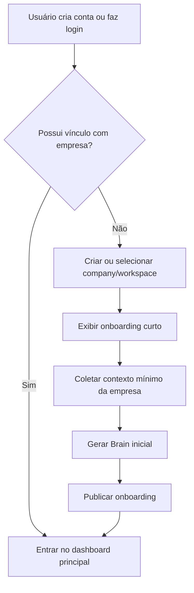

# Workana AI — Documento de Requisitos e Escopo

**Versão:** 1.1  
**Data:** 20 de maio de 2026  
**Autor:** Adryan Rodrigues  
**Status:** Em desenvolvimento — Fase 1 (MVP)

---

## 1. Visão Geral

### 1.1 Resumo Executivo
O **Workana AI** é uma camada de inteligência B2B para empresas que contratam, coordenam e escalam trabalho com freelancers, fornecedores e times remotos. O produto centraliza contexto, briefings, demandas, agentes de IA, créditos, equipe, permissões e integrações dentro de um workspace por empresa.

O produto nasce como um sistema operacional B2B para coordenação de trabalho externo, com IA aplicada a contexto, briefing, execução e governança.

### 1.2 Problema que Resolve
- Briefings desorganizados
- Perda de contexto entre empresa e prestadores
- Alinhamento manual repetitivo
- Baixa visibilidade sobre demandas
- Comunicação pouco padronizada
- Dificuldade de escalar trabalho com consistência

### 1.3 Público
- Primário: empresas que contratam freelancers com frequência; times de marketing, produto, operação e conteúdo; PMEs e equipes com colaboradores externos.
- Secundário: agências, startups, fornecedores e times internos com parceiros recorrentes.

### 1.4 Proposta de Valor
Workana AI ajuda empresas a operar com mais inteligência ao centralizar contexto, processos e execução de trabalho com IA.

---

## 2. Arquitetura e Stack

### 2.1 Estrutura do Monorepo
| Pacote | Tecnologia | Responsabilidade |
|---|---|---|
| `apps/web` | Next.js 16, React 19 | Frontend principal |
| `apps/api` | NestJS 11 | API REST, auth, Prisma, CASL |
| `packages/authz` | CASL | Catálogo de permissões, roles e mapa CASL |
| `packages/types` | Zod | Schemas e tipos compartilhados |
| `packages/configs` | TypeScript | Presets de configuração |

### 2.2 Stack Confirmada
**Frontend**
- Next.js 16 App Router
- React 19
- Tailwind CSS v4 com tokens em `globals.css`
- shadcn/ui
- react-hook-form + Zod
- TanStack Query
- TanStack Table
- Recharts
- nuqs
- Axios
- Lucide React

**Backend**
- NestJS 11
- Prisma
- better-auth para auth e sessão
- CASL para autorização
- Zod para validação de DTOs
- Resend para emails transacionais

**Tooling**
- pnpm
- Turborepo
- Biome
- TypeScript strict

---

## 3. Entidades do Domínio

- User
- Company
- Membership
- Role
- Permission
- Invitation
- CompanyBrain
- BrainAsset
- Agent
- AgentRun
- CreditLedger
- Integration
- AuditLog

---

## 4. Módulos Funcionais

### 4.1 Autenticação e Sessão
- Login e autenticação fazem parte do MVP.
- `better-auth` trata apenas autenticação e sessão.
- `userId` vem sempre de `req.currentUser.id`, nunca do body.
- Endpoints sem `Public` são bloqueados automaticamente pelo `AuthGuard`.

### 4.2 Company / Workspace
- Primeiro acesso sem convite leva à criação ou seleção de empresa.
- Um usuário pode participar de várias empresas.
- Cada empresa tem membros, roles, permissões, Brain e créditos próprios.
- `orgId` vem de `req.params`, nunca do body.

### 4.3 Onboarding
O onboarding deve ser curto, visual, direto e com autosave. Ele coleta o mínimo necessário para inicializar o Brain.

Etapas:
1. Boas-vindas
2. Nome e segmento da empresa
3. Objetivo principal
4. Público-alvo
5. Tom de voz
6. Canais de trabalho
7. Referências, arquivos ou assets
8. Revisão e publicação do Brain

### 4.4 Brain da Empresa
O Brain é o núcleo de contexto do produto e guarda conhecimento reutilizável para agentes e usuários.

Armazena:
- nome, segmento e descrição da empresa
- objetivos e público-alvo
- tom de voz e preferências
- instruções de marca
- processos, regras e FAQs
- arquivos, assets e referências

### 4.5 Convites
O convite contém email, empresa, role sugerida, permissões associadas, status, expiração e token único.

Estados:
- pendente
- aceito
- expirado
- cancelado

### 4.6 Roles e Permissões
Roles atuais de sistema:
- owner
- admin
- member

Roles futuras de produto:
- manager
- editor
- viewer
- custom

Regras:
- Toda ação do produto deve ter verificação de permissão sem exceção.
- Backend: todo endpoint de mutação ou dado sensível deve ter `RequirePermission` com chave válida.
- Frontend: toda UI com ação de escrita, exclusão ou dado restrito deve usar `PermissionGate` ou `useAbility`.
- Permissões continuam centralizadas em `packages/authz` e avaliadas via CASL no backend e frontend.

### 4.7 Créditos
- Cada empresa tem saldo próprio.
- Cada ação de IA consome créditos.
- O consumo deve ser visível por agente e por usuário.

Estados:
- saudável
- baixo
- crítico
- limite atingido

### 4.8 Agentes
Agente é uma unidade operacional de IA com objetivo, workflow, instruções e resultado esperado.

Agentes no MVP:
- catálogo visível custom-only por empresa
- agente interno de contexto para chat geral
- workflow e versionamento por agente
- branch de conversa ao editar mensagem
- execução com fila FIFO, limite de 3 simultâneas por empresa e 1 retry na mesma run

Estados:
- draft
- active
- paused
- error
- archived

---

## 5. Segurança e Autenticação

### 5.1 Princípios de Segurança
- Toda ação, acesso, mutação, visualização restrita e fluxo derivado deve ser guiado por permissão.
- Nenhuma feature nasce sem guards e checks de UI como parte da definição de pronto.
- A API nunca deve vazar metadados internos da IA em contratos de produto sem decisão explícita documentada.
- A camada interna de interpretação, ranking, recuperação e contexto derivado da IA nunca deve ser exposta ao usuário final.

### 5.2 Regras Invioláveis
- `userId` nunca vem do body.
- `orgId` nunca vem do body.
- Novos endpoints sem `Public` ficam protegidos automaticamente pelo `AuthGuard`.
- Nova permissão nasce em `packages/authz` antes de ser usada em qualquer lugar.
- Prisma é o único cliente de banco; não se deve editar `generated/prisma` manualmente.
- Roles de sistema `owner`, `admin` e `member` são imutáveis.

### 5.3 Cadeia de Proteção
- O `AuthGuard` global valida cookie ou bearer e popula `req.currentUser`.
- O `PermissionGuard` é ativado quando `RequirePermission` existe.
- A habilidade efetiva é calculada por membership e permissões agregadas.
- O frontend deve espelhar essas regras com `PermissionGate` e verificações de ability.

### 5.4 Regras de Negócio Sensíveis
- Não remover o último owner.
- Não remover o último role de um membro.
- `onboarding.publish` não é assignable livremente.
- `better-auth` não deve reassumir responsabilidades de org ativa, roles ou permissões.

### 5.5 Validação e Erros
- DTOs devem ser validados com Zod antes de chegar ao service.
- Recurso não encontrado: `NotFoundException`.
- Ação proibida: `ForbiddenException`.
- Dados inválidos: `BadRequestException`.
- Conflitos de unicidade ou estado: `ConflictException`.

---

## 6. Fluxos Principais

### 6.1 Primeiro acesso sem convite
1. Usuário cria conta ou faz login
2. Sistema detecta ausência de vínculo com empresa
3. Usuário cria ou confirma uma company/workspace
4. Sistema exibe onboarding curto
5. Onboarding coleta contexto mínimo
6. Sistema gera o Brain inicial
7. Usuário entra no dashboard principal

### 6.2 Primeiro acesso com convite
1. Admin envia convite por email
2. Usuário abre link único
3. Usuário faz login ou cadastro
4. Sistema aceita vínculo com a empresa
5. Usuário entra no workspace com role e permissões definidas

### 6.3 Operação contínua
1. Time acessa workspace
2. Consulta Brain e agentes
3. Executa tarefas com IA
4. Consome créditos
5. Acompanha histórico, permissões e integrações

---

## 7. Diagrama de Onboarding

---

## 8. Navegação Principal
- Dashboard
- Brain
- Agentes
- Equipe
- Créditos
- Integrações
- Configurações

---

## 9. Direção Visual

### 9.1 Princípios
A interface deve evitar aparência genérica de dashboard SaaS. O objetivo é parecer um sistema autoral, premium e operacional.

### 9.2 Direção aprovada
- Light theme como default
- Fundo off-white frio puxado para azul
- Azul como cor principal
- Dourado apenas para premium
- Lime discreto para IA ativa
- Nada de preto absoluto
- Nada de branco puro em superfícies principais quando houver alternativa tokenizada

### 9.3 Tipografia e componentes
- Display: Instrument Serif ou equivalente editorial
- UI: Geist, Satoshi, General Sans ou Inter
- Mono: Geist Mono, JetBrains Mono ou IBM Plex Mono
- Tokens semânticos obrigatórios; sem cor raw quando houver token equivalente
- Ícones via Lucide React
- Gráficos com tokens `--chart-1` até `--chart-8`

---

## 10. Escopo do MVP

### 10.1 Dentro do escopo
- login e autenticação
- criação ou seleção de company/workspace
- convite de membros por email
- onboarding curto da empresa
- Brain da empresa com texto, instruções, arquivos e assets
- roles e permissões por empresa
- créditos de IA por empresa
- agentes customizados por empresa
- histórico de execuções
- configurações do workspace

### 10.2 Fora do escopo inicial
- marketplace público completo
- pagamento/escrow
- busca aberta de freelancers
- matching sofisticado
- app mobile nativo
- reputação financeira complexa

---

## 11. Roadmap

### Fase 1
- Auth
- Criação/seleção de empresa
- Onboarding
- Brain
- Convites
- Roles e permissões
- Créditos
- Agentes iniciais
- Dashboard

### Fase 2
- Integrações
- Templates
- Mais agentes
- Histórico avançado
- Permissões finas
- Melhorias de UX

### Fase 3
- Automações robustas
- Analytics
- Workflows visuais
- Personalização por empresa

---

## 12. Decisões Fixadas
- O produto se chama Workana AI.
- O foco é empresa e operação, não marketplace.
- O primeiro login sem convite leva à criação ou seleção de company.
- O onboarding é curto e fluido.
- Cada empresa tem Brain próprio.
- Convites são por email.
- Roles e permissões são obrigatórias.
- Créditos são por empresa.
- Agentes customizados por empresa fazem parte do MVP; agentes internos do sistema não aparecem no catálogo V1.
- A UI deve ser única, forte e não genérica.
- Azul é a base visual principal.

---

## 13. Métricas de Sucesso
- Empresas com Brain publicado após onboarding
- Agentes executados por empresa por semana
- Créditos consumidos vs saldo médio
- Taxa de aceite de convites
- Tempo médio do primeiro briefing gerado por IA após onboarding
