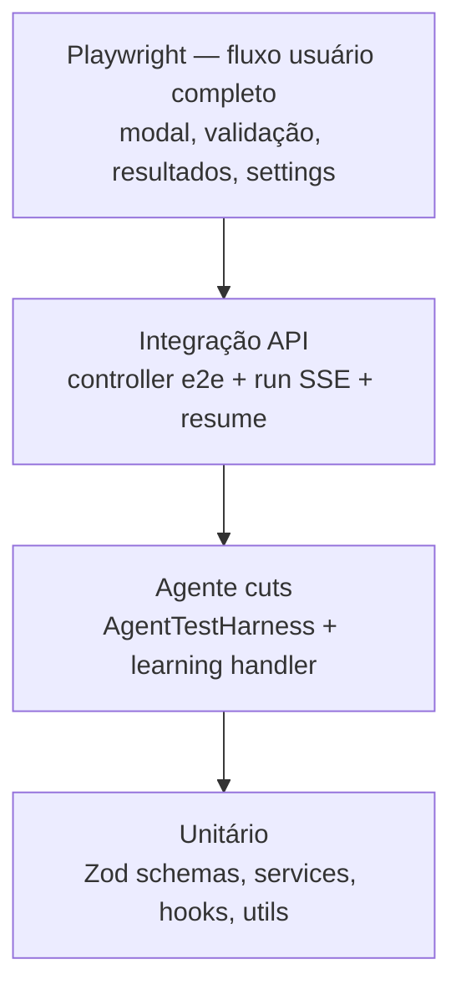
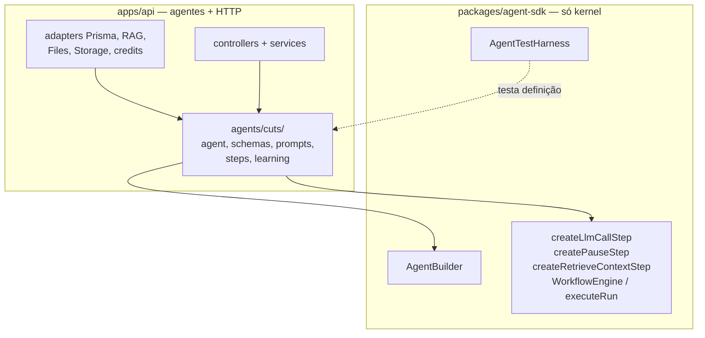
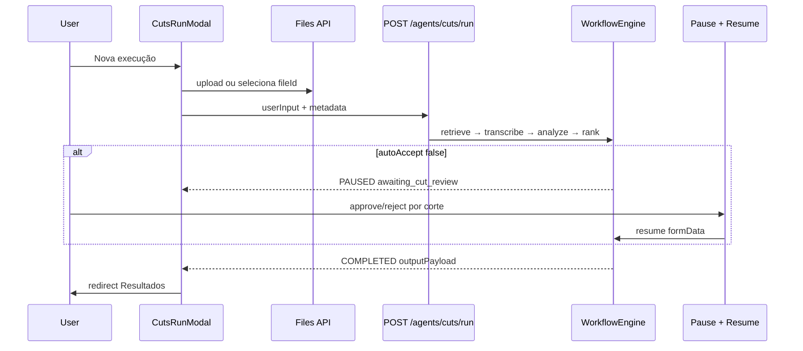
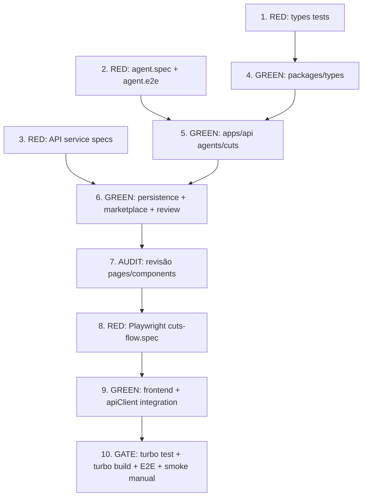

# Plano: Fluxo completo — Gerador de Cortes

## Metodologia: TDD + separação Backend / SDK

### Testes primeiro, código depois

Cada entrega segue **Red → Green → Refactor**:

1. **RED** — escrever teste que falha descrevendo o comportamento esperado
2. **GREEN** — implementar o mínimo para passar
3. **REFACTOR** — limpar sem quebrar testes

Ordem global: **contratos → agente → API → auditoria frontend → E2E → UI → integração → gate final**.

### Definition of Done (obrigatório para encerrar)

**A entrega só é considerada finalizada quando TODOS os critérios abaixo forem atendidos simultaneamente:**


| Critério                      | Comando / verificação                                                                       |
| ----------------------------- | ------------------------------------------------------------------------------------------- |
| Testes unitários/contratos    | `pnpm test` na raiz (`turbo test`) — **0 falhas**                                           |
| Testes do agente cuts         | `apps/api` — `agent.spec.ts` + learning handler specs                                       |
| Testes de funcionalidades API | specs NestJS: settings, marketplace, files, review/resume, runs                             |
| Build backend                 | `pnpm --filter api build` — **0 erros TypeScript/Nest**                                     |
| Build frontend                | `pnpm --filter web build` — **0 erros Next.js**                                             |
| Build packages                | `pnpm --filter @company-os/types build` + `@company-os/agent-sdk build`                     |
| E2E Playwright                | `pnpm --filter web test:e2e` — fluxo cuts completo **verde**                                |
| Integração real               | Frontend **sem** fixtures de produto para cuts; hooks chamam API live                       |
| Lógica de produto             | Modal → run → pause/review → Resultados → sidebar pulse — comportamento correto manualmente |
| Regressão                     | Testes existentes do monorepo continuam passando                                            |
| Auditoria frontend            | §2.0 concluída — padrões layout/estilo documentados antes de codar UI cuts                  |


**Proibido declarar "pronto"** com testes skipped, `@ts-ignore` de lógica, mocks de produto ainda ativos no fluxo cuts, build quebrado, ou **UI cuts sem auditoria §2.0**.

### Pirâmide de testes (obrigatória)




| Camada                          | Escopo                                                                   | Arquivos alvo                                                                 |
| ------------------------------- | ------------------------------------------------------------------------ | ----------------------------------------------------------------------------- |
| **Unit — contratos**            | Schemas Zod, helpers de formatação (timestamps, viralScore)              | `packages/types/src/agents/cuts*.test.ts`                                     |
| **Unit — agente**               | Workflow steps, pause/resume, output shape, learning index               | `apps/api/src/agents/cuts/agent.spec.ts`, `learning/feedback-handler.spec.ts` |
| **Unit — funcionalidades**      | Settings CRUD, marketplace caption-style, files validate, review service | `*.service.spec.ts`, `*.controller.spec.ts`                                   |
| **Integração — agent run**      | `POST /agents/cuts/run` → steps → `PAUSED`/`COMPLETED`; `POST resume`    | `apps/api/src/agents/cuts/agent.e2e.spec.ts` ou supertest no controller       |
| **Integração — frontend hooks** | Vitest + MSW ou test server: hooks consomem contratos reais              | `apps/web/src/core/modules/agents/hooks/*.test.ts`                            |
| **E2E — produto**               | Usuário real no browser: nova execução → gerar → validar → resultados    | `apps/web/e2e/cuts-flow.spec.ts`                                              |


### Onde vive cada coisa




| Camada                     | Responsabilidade                                                                                                              | Proibido                                                                      |
| -------------------------- | ----------------------------------------------------------------------------------------------------------------------------- | ----------------------------------------------------------------------------- |
| `**packages/agent-sdk**`   | Kernel de workflow, primitivas de step, stream events, test harness                                                           | Pastas `agents/<id>/`, prompts de produto, lógica de domínio cuts             |
| `**apps/api/src/agents/**` | Definição completa de cada agente (`cuts`, futuros), schemas, prompts, steps custom, `learning/feedback-handler.ts`, registry | Controllers com lógica de negócio inline; `if (agentId === 'cuts')` no engine |
| `**packages/types**`       | Contratos Zod compartilhados (input/output/settings/review)                                                                   | Lógica de execução                                                            |


> **Nota:** a rule `.cursor/rules/agent-sdk-monolith.mdc` será desatualizada — alinhar doc após implementação para refletir **agentes no backend, SDK = kernel**.

---

## Diagnóstico (estado atual)


| Área        | Estado                                                                                                      | Gap principal                                               |
| ----------- | ----------------------------------------------------------------------------------------------------------- | ----------------------------------------------------------- |
| Frontend    | `[cuts-generation.tsx](apps/web/src/core/modules/agents/components/generations/cuts-generation.tsx)` — mock | Sem modal, config, validação por corte, picker Arquivos     |
| Backend     | `[cuts/agent.ts](apps/api/src/agents/cuts/agent.ts)` — 4 steps stub                                         | Sem transcribe/analyze/pause/review; `editStyleId` obsoleto |
| SDK         | Primitivas prontas (`AgentBuilder`, `createPauseStep`, harness)                                             | **Não** recebe implementação do agente cuts                 |
| Marketplace | `CAPTION_STYLE` no Prisma, sem seed                                                                         | Legendas não resgatáveis                                    |
| Testes cuts | **Inexistentes**                                                                                            | TDD exige specs antes de expandir agente                    |


**Produto:** sem Edit Style no fluxo de cortes; legendas via `caption-style` owned quando `addCaptions=true`.

---

## Arquitetura alvo




---

## Fase 1 — Backend (TDD)

### 1.0 Contratos (`packages/types`) — RED then GREEN

**Testes primeiro** (`packages/types/src/agents/cuts*.test.ts` ou colocated spec):

- `cutsAgentSettingsSchema` — defaults, limites, `captionStyleId` obrigatório se `addCaptions`
- `cutsRunInputSchema` — snapshot de config + `sourceFileId`
- `cutOutputSchema` — `viralScore` 0–100, `reviewStatus` enum
- `cutsRunOutputSchema` — array mínimo de cortes
- `reviewCutsSchema` — `decisions[]` com `cutId` + `approve|reject`

**Schemas:**

`**cutsAgentSettingsSchema`:** `maxCuts`, `cutDurationSec`, `deleteSourceAfterRun`, `addCaptions`, `captionStyleId?`, `autoAcceptResults`

`**cutOutputSchema`:** `id`, `title`, `description`, `startSec`, `endSec`, `durationSec`, `viralScore` (0–100), `reviewStatus`, `previewUrl?`

Remover `editStyleId` de input/output de cortes.

---

### 1.1 Agente cuts — RED then GREEN em `apps/api`

**Local:** `[apps/api/src/agents/cuts/](apps/api/src/agents/cuts/)`

```
apps/api/src/agents/cuts/
  agent.ts              ← AgentBuilder + steps
  schemas/output.schema.ts
  prompts/cuts.prompts.ts
  steps/                ← resolve-source, analyze-source (custom run fns)
  learning/feedback-handler.ts
  agent.spec.ts         ← AgentTestHarness (importa cutsAgent de ./agent)
  agent.e2e.spec.ts     ← HTTP/supertest: run + stream + resume (obrigatório)
  learning/feedback-handler.spec.ts
```

**Testes RED (`agent.spec.ts`) — escrever antes do código:**


| Caso                                       | Assert                                                              |
| ------------------------------------------ | ------------------------------------------------------------------- |
| Run completo com `autoAcceptResults: true` | status `COMPLETED`; N cortes; cada um com timestamps + viralScore   |
| Run com `autoAcceptResults: false`         | pausa em `await_cut_review`; `pauseReason` claro                    |
| Resume com `cutDecisions`                  | cortes aprovados/rejeitados refletidos no output                    |
| `sourceFileId` inválido                    | step `resolve_source` falha com erro claro                          |
| `maxCuts` / `cutDurationSec`               | LLM step recebe constraints no prompt (mock LLM)                    |
| `deleteSourceAfterRun: true`               | adapter delete chamado após finalize                                |
| Learning handler                           | approve/reject por corte indexa RAG com título, duração, viralScore |


**Testes RED (`agent.e2e.spec.ts`) — integração HTTP do agente:**


| Caso                                        | Assert                                                            |
| ------------------------------------------- | ----------------------------------------------------------------- |
| `POST /agents/cuts/run` com file válido     | 202 + runId; steps até COMPLETED ou PAUSED                        |
| SSE/stream                                  | eventos de step batem com fases UI (transcribe, analyze, rank)    |
| Run PAUSED + `POST resume` com cutDecisions | output final com reviewStatus por corte                           |
| Settings PATCH + run                        | metadata do run reflete config salva                              |
| Pending query                               | `GET runs?reviewStatus=pending` retorna runs aguardando validação |


Usar `[AgentTestHarness](packages/agent-sdk/src/testing/agent-test-harness.ts)` do SDK — **sem** mover o agente para o SDK.

**Workflow alvo (implementação GREEN em `agent.ts`):**


| Step               | Primitiva SDK                                | Comportamento                                     |
| ------------------ | -------------------------------------------- | ------------------------------------------------- |
| `retrieve_context` | `createRetrieveContextStep()`                | RAG settings + learning                           |
| `resolve_source`   | custom step fn                               | Valida file no workspace; extract/STT via adapter |
| `analyze_source`   | custom step fn                               | Segmenta transcrição                              |
| `rank_segments`    | `createLlmCallStep()`                        | N cortes com transcript + constraints             |
| `await_cut_review` | `createPauseStep({ pauseType: 'approval' })` | Só se `!autoAcceptResults`                        |
| `finalize_cuts`    | `createOutputStep()`                         | Persiste output; auto-approve se config           |
| `cleanup_source`   | custom step fn                               | Delete file se configurado                        |


**Adapters injetados** em `[apps/api/src/agents/adapters/](apps/api/src/agents/adapters/)` ou runtime deps — Prisma Files, extract port, storage delete. SDK não conhece Prisma.

---

### 1.2 Persistência + marketplace — RED then GREEN

**Testes RED primeiro:**

- `workspace-settings.service.spec.ts` — GET/PATCH cuts settings por workspace
- `marketplace.service.spec.ts` — list/filter `caption-style`; redeem; entitlement check no settings PATCH

**Implementação GREEN:**

- Migration `WorkspaceAgentSettings` em `[schema.prisma](apps/api/prisma/schema.prisma)`
- `GET/PATCH /api/workspace-settings/agents/:agentId`
- Seed `CAPTION_STYLE` em `[seed-marketplace.ts](apps/api/prisma/seed-marketplace.ts)`
- Atualizar `[marketplace.service.ts](apps/api/src/marketplace/marketplace.service.ts)` + `[packages/types](packages/types/src/blister-os.ts)`

---

### 1.3 Review API — RED then GREEN

**Testes RED:**

- `agent-run-review.service.spec.ts` — resume com `reviewCutsSchema`; run passa de `PAUSED` → `COMPLETED`
- Controller spec — `POST /runs/:id/resume` body validation

**Implementação GREEN:**

- Estender `[packages/types/src/agents.ts](packages/types/src/agents.ts)` com `reviewCutsSchema`
- `POST /api/agents/runs/:runId/resume` com `{ formData: { cutDecisions } }`
- Atualizar `[agent-run-review.service.ts](apps/api/src/agents/runtime/agent-run-review.service.ts)` + `[cuts/learning/feedback-handler.ts](apps/api/src/agents/cuts/learning/feedback-handler.ts)` (decisões por corte)
- `GET /api/agents/cuts/runs?reviewStatus=pending` para sidebar

---

---

## Fase 2 — Frontend + integração (TDD)

> **Pré-requisito bloqueante:** concluir **§2.0 Auditoria frontend** antes de escrever qualquer componente ou teste E2E de UI cuts. Objetivo: reutilizar padrões existentes — não inventar layout/estilo do zero.

### 2.0 Auditoria frontend — revisão antes de implementar

**Quando:** após backend GREEN (Fase 1) e **antes** de `tdd-frontend-e2e` RED e qualquer código de UI cuts.

**Entregável:** nota curta (comentário no PR ou seção no plano) com padrões confirmados — quais componentes reutilizar, tokens, gaps vs reference HTML.

#### Escopo da revisão (ler, não reescrever)


| Área                   | Arquivos / pastas                                                                                                                                                                                                                                                                                                                                                                                         | O que mapear                                                                  |
| ---------------------- | --------------------------------------------------------------------------------------------------------------------------------------------------------------------------------------------------------------------------------------------------------------------------------------------------------------------------------------------------------------------------------------------------------- | ----------------------------------------------------------------------------- |
| **Shell e navegação**  | `[dashboard-shell.tsx](apps/web/src/core/modules/dashboard/components/dashboard-shell.tsx)`, `[app-sidebar.tsx](apps/web/src/core/shared/components/ui/app-sidebar.tsx)`, `[use-dashboard-nav-groups.ts](apps/web/src/core/modules/dashboard/hooks/use-dashboard-nav-groups.ts)`                                                                                                                          | Grupos sidebar, subitens agente, `badge`/`statusTone`/`ds-ai-pulse`, collapse |
| **Layout de página**   | `[page-layout.tsx](apps/web/src/core/shared/components/ui/page-layout.tsx)`, `[section-card.tsx](apps/web/src/core/shared/components/ui/section-card.tsx)`, `[app-shell.tsx](apps/web/src/core/shared/components/app-shell.tsx)`                                                                                                                                                                          | `gap-6` entre seções, `SurfaceIcon` + `Heading`/`Paragraph`, slot `actions`   |
| **Tipografia**         | `[heading.tsx](apps/web/src/core/shared/components/ui/heading.tsx)`, `[paragraph.tsx](apps/web/src/core/shared/components/ui/paragraph.tsx)`, rule `typography-components.mdc`                                                                                                                                                                                                                            | Nunca `<h1>`/`<p>` raw; níveis e `tone`                                       |
| **Agentes existentes** | `[agent-overview-page.tsx](apps/web/src/core/modules/agents/pages/agent-overview-page.tsx)`, `[agent-history-page.tsx](apps/web/src/core/modules/agents/pages/agent-history-page.tsx)`, `[agent-settings-page.tsx](apps/web/src/core/modules/agents/pages/agent-settings-page.tsx)`, `[video-editor-generation.tsx](apps/web/src/core/modules/agents/components/generations/video-editor-generation.tsx)` | Wizard com `BlisterStepper`, `MarketplaceStyleThumb`, padrão settings RHF+Zod |
| **Blister primitives** | `[blister-stepper.tsx](apps/web/src/core/shared/components/blister/blister-stepper.tsx)`, `[file-dropzone.tsx](apps/web/src/core/shared/components/blister/file-dropzone.tsx)`, `[marketplace-style-thumb.tsx](apps/web/src/core/shared/components/blister/marketplace-style-thumb.tsx)`, `[blister-chip-row.tsx](apps/web/src/core/shared/components/blister/blister-chip-row.tsx)`                      | Componentes a compor no modal cuts                                            |
| **Modais e overlays**  | `[dialog.tsx](apps/web/src/core/shared/components/ui/dialog.tsx)`, `[files-page.tsx](apps/web/src/core/modules/files/pages/files-page.tsx)` (Dialog nova pasta), `[member-invite-dialog.tsx](apps/web/src/core/modules/workspace/components/member-invite-dialog.tsx)`                                                                                                                                    | Tamanho, header/footer, animação `tw-animate-css`                             |
| **Tabelas e listas**   | `[data-table.tsx](apps/web/src/core/shared/components/ui/data-table.tsx)`, `[marketplace-page.tsx](apps/web/src/core/modules/marketplace/pages/marketplace-page.tsx)`, `[files-page.tsx](apps/web/src/core/modules/files/pages/files-page.tsx)`                                                                                                                                                           | Padrão Resultados + file picker                                               |
| **Forms**              | `[agent-settings-page.tsx](apps/web/src/core/modules/agents/pages/agent-settings-page.tsx)`, `[settings-page.tsx](apps/web/src/core/modules/settings/pages/settings-page.tsx)`                                                                                                                                                                                                                            | `FormField`, `Switch`, `mode: 'onBlur'`                                       |
| **Home / KPIs**        | `[blister-os-home-page.tsx](apps/web/src/core/modules/dashboard/pages/blister-os-home-page.tsx)`, `[agent-overview-stats.tsx](apps/web/src/core/modules/agents/components/agent-overview-stats.tsx)`                                                                                                                                                                                                      | Cards de métricas, warning tone                                               |
| **Design tokens**      | `[docs/design-system/tokens.md](docs/design-system/tokens.md)`, `[usage-rules.md](docs/design-system/usage-rules.md)`, `[blister-os-reference.md](docs/design-system/blister-os-reference.md)`, `[blister-os-reference.html](blister-os-reference.html)` § CortesPage                                                                                                                                     | CSS vars `--line-default`, `--bg-sunken`, `--r-lg`, barras de retenção        |
| **i18n**               | `[pt-BR.json](apps/web/messages/pt-BR.json)` keys `cuts.`*, `agents.*`, `sidebar.*`                                                                                                                                                                                                                                                                                                                       | Copy operacional PT-BR                                                        |


#### Checklist de padrões a confirmar na auditoria

- [ ] Espaçamento: `gap-6` entre seções, `gap-4` dentro de grupos (regra CLAUDE.md §12)
- [ ] Páginas agente usam `PageLayout` + `AgentEntitlementGate`
- [ ] Wizards usam `BlisterStepper` + botões back/next (referência: video editor)
- [ ] Modais: `Dialog` shadcn, footer com ações primária/secundária
- [ ] Estados: loading (`animate-pulse` ou spinner), empty state com border dashed
- [ ] Cores via tokens CSS (`var(--*)`), não hex solto exceto palettes marketplace
- [ ] Animações em overlays/interativos (`tw-animate-css`)
- [ ] `data-testid` em superfícies testáveis (padrão E2E existente)
- [ ] O que **não** reutilizar: `[cuts-generation.tsx](apps/web/src/core/modules/agents/components/generations/cuts-generation.tsx)` atual (substituído pelo modal); Edit Style no fluxo cuts

#### Saída da auditoria → decisões para implementação cuts

Documentar explicitamente antes de codar:

1. **Estrutura do modal** — full-screen vs `max-w-4xl`; espelhar Dialog de convite ou reference HTML
2. **CutReviewCard** — espelhar row de `CortesPage` no HTML (barra retenção, intervalo mono)
3. **Overview/Resultados** — estender páginas genéricas vs componentes `cuts-`* dedicados
4. **File picker** — extrair padrão de browse de `files-page` para modal reutilizável

**Critério para avançar:** auditoria concluída + padrões listados → só então iniciar `tdd-frontend-e2e` RED.

### 2.1 E2E primeiro — RED

Criar `[apps/web/e2e/cuts-flow.spec.ts](apps/web/e2e/cuts-flow.spec.ts)` (spec dedicado) **antes** da UI — contra **API real**:

- Abrir modal "Nova execução" a partir do overview
- Selecionar fonte (upload ou Arquivos via API)
- Progresso transcribe → analyze → generate (SSE)
- Validar corte (aceitar/negar) quando autoAccept off
- Banner + sidebar pulse com run pending
- Salvar settings (6 campos) e recarregar página
- Página Resultados com detalhe de execução + aceitar/negar retroativo

Testes falham até GREEN da Fase 2.2–2.8.

### 2.2 Integração API — GREEN (obrigatório antes de encerrar)

Substituir mocks Plano 2 no fluxo cuts:


| Frontend             | API                                                  |
| -------------------- | ---------------------------------------------------- |
| `use-cuts-settings`  | `GET/PATCH /workspace-settings/agents/cuts`          |
| `use-cuts-runs`      | `GET /agents/cuts/runs`, detalhe run, pending count  |
| `use-cuts-run-modal` | `POST /agents/cuts/run` + SSE stream + `POST resume` |
| `use-caption-styles` | `GET /marketplace/entitlements?type=caption-style`   |
| File picker / upload | `GET /files/browse`, `POST /files/upload`, preview   |


- Remover dependência de `blister-os-store` para runs/settings no módulo cuts
- TanStack Query com invalidação após run/resume/settings save
- Tratamento de erro e estados loading/failed em todo fluxo modal

**Testes:** Vitest nos hooks (`*.test.ts`) — parsing Zod das respostas e estados de erro.

### 2.3 Hooks + modal + páginas — GREEN

Mesmo escopo da versão anterior do plano:

- `**CutsRunModal`** — Dialog + BlisterStepper: Fonte → Gerar → Validar → Concluído
- `**FilePickerModal`** — browse Arquivos via API
- **Settings** — 6 campos persistidos via API
- **Overview / Resultados / Sidebar** — redesign completo
- Nav **"Resultados"** (rota `/results`, redirect de `/history`)
- `[AgentNewRunButton](apps/web/src/core/modules/agents/components/agent-new-run-button.tsx)` abre modal (não `/new`)

Componentes em `apps/web/src/core/modules/agents/components/cuts/`.

---

## Ordem de execução (atualizada)




---

## Gate final de verificação (passo 10 — bloqueante)

Executar **em sequência** e corrigir até zerar falhas:

```bash
# 1. Testes de todo o monorepo (types, agent-sdk, api, web unit)
pnpm test

# 2. Builds
pnpm --filter @company-os/types build
pnpm --filter @company-os/agent-sdk build
pnpm --filter api build
pnpm --filter web build

# 3. E2E fluxo cuts (API + web rodando)
pnpm --filter web test:e2e -- cuts-flow

# 4. Smoke manual (checklist)
# - Nova execução modal: upload + gerar + validar cortes
# - Resultados: aceitar/negar + banner pending
# - Settings: 6 campos persistem após reload
# - Sidebar: pulse quando pending; click vai para validação
# - Nova execução paralela com outra pending: permitido
```

**Só marcar entrega como concluída após o gate 100% verde.**

---

## Riscos e mitigações


| Risco                           | Mitigação                                                                 |
| ------------------------------- | ------------------------------------------------------------------------- |
| STT/render ausentes             | Adapter stub em `resolve_source`; testes mockam transcript                |
| Rule SDK monolith desatualizada | Atualizar `.cursor/rules/agent-sdk-monolith.mdc` + `CLAUDE.md` após merge |
| viralScore 0–1 vs 0–100         | Contrato **0–100**; normalizar no step `rank_segments`                    |
| Harness acoplado ao SDK         | Harness importa `cutsAgent` de `apps/api` nos testes — padrão válido      |
| E2E flaky com API               | Seed determinístico + workspace de teste; retry só após fix de race       |
| Declarar pronto cedo            | Gate bloqueante §10; todo `gate-verification` = completed                 |
| UI inconsistente com OS         | Auditoria §2.0 obrigatória antes de qualquer componente cuts              |
