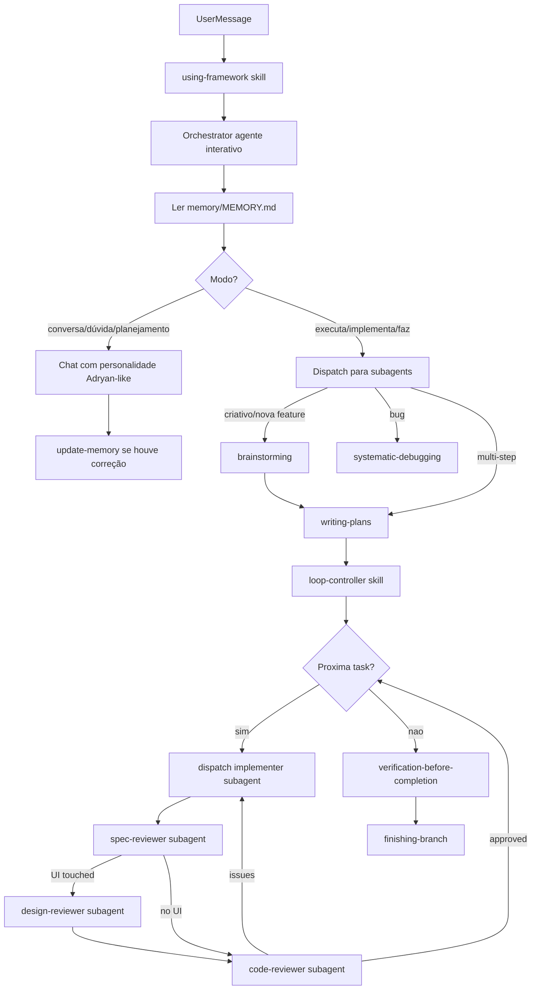

# Framework de IA Pessoal — Plugin com Loops e Agentes

> Plano aprovado em 2026-07-03. Plugin pessoal `adryan-dev-loop` — genérico para stack NestJS/Next/Tailwind com preset Blister.

## Objetivo

Entregar um **plugin pessoal** (repo separado, instalável no Cursor como Superpowers) que qualquer IA consiga seguir. O núcleo é um arquivo mestre `FRAMEWORK.md` — documento completo de bootstrap — que define agentes, loops, skills, presets e gates de qualidade.

**Escopo confirmado:** genérico para seu stack, com **preset Blister** como default quando o projeto tiver `docs/design-system/` ou `blister-os-reference.html`.

---

## Arquitetura (baseada em Superpowers + seu código)



**Princípios herdados do Superpowers:**
- Skills invocados **antes** de qualquer ação (1% de chance = invocar)
- Prioridade: instruções do usuário > skills do framework > system prompt
- Process skills primeiro (brainstorm, debug), implementation skills depois
- Subagent fresh context + two-stage review (spec → quality/design)

**Princípios extraídos do blister-monorepo:**
- Código em inglês; UI em PT-BR via i18n
- Zod em toda fronteira; RHF + `mode: 'onBlur'`; TanStack Query via hooks; nuqs para URL state
- Server Components por padrão; `"use client"` só quando necessário
- Design system: tokens semânticos (`var(--bg-*)`), nunca `dark:` utility, `gap-6`/`gap-4`, `PageLayout`, `DataTable`, `StatusModal`
- Backend: `@RequirePermission`, `userId` de `req.currentUser.id`, Prisma único acesso ao banco

---

## Estrutura do plugin (repo pessoal)

```
adryan-dev-loop/                    # nome sugerido do repo
├── AGENTS.md                       # Entry point — qualquer IA lê primeiro
├── FRAMEWORK.md                    # ARQUIVO MESTRE (bootstrap completo)
├── README.md                       # Como instalar no Cursor
├── memory/                         # Memória evolutiva (sempre lida pelo Orchestrator)
│   ├── MEMORY.md                   # Índice + aprendizados recentes (hot cache)
│   ├── voice/
│   │   ├── patterns.md             # Como Adryan fala (extraído de transcripts)
│   │   └── corrections.md          # Correções de tom que o usuário pediu
│   ├── code/
│   │   ├── good-examples.md        # Código aprovado (padrão a seguir)
│   │   ├── bad-examples.md         # Código rejeitado + motivo
│   │   └── corrections.md          # Fixes específicos que o usuário pediu
│   └── behavior/
│       ├── preferences.md          # Como o usuário prefere que agentes ajam
│       └── anti-patterns.md        # Coisas que irritam / nunca fazer
├── agents/
│   ├── orchestrator/               # AGENTE PRINCIPAL — interativo, com personalidade
│   │   ├── persona.md              # Identidade, tom de voz, regras de fala
│   │   ├── voice-profile.md        # Perfil linguístico baseado no jeito do Adryan
│   │   └── orchestrator-prompt.md  # System prompt completo do agente
│   ├── implementer-prompt.md
│   ├── spec-reviewer-prompt.md
│   ├── design-reviewer-prompt.md
│   └── code-reviewer-prompt.md
├── presets/
│   ├── default.md                  # Stack genérico (NestJS/Next/Tailwind)
│   └── blister/
│       ├── manifest.json           # Detecta: blister-os-reference.html, docs/design-system/
│       ├── design-system.md        # Extraído de .claude/commands/design.md + usage-rules.md
│       ├── frontend.md             # Extraído de .claude/commands/frontend.md
│       ├── backend.md              # Extraído de .claude/commands/backend.md
│       └── review.md               # Extraído de .claude/commands/review.md
├── skills/
│   ├── using-framework/SKILL.md
│   ├── orchestrator/SKILL.md
│   ├── update-memory/SKILL.md
│   ├── loop-controller/SKILL.md
│   ├── brainstorming/SKILL.md
│   ├── writing-plans/SKILL.md
│   ├── implement-frontend/SKILL.md
│   ├── implement-backend/SKILL.md
│   ├── implement-tests/SKILL.md
│   ├── validate-design/SKILL.md
│   ├── review-code/SKILL.md
│   ├── review-spec/SKILL.md
│   ├── systematic-debugging/SKILL.md
│   ├── verification-before-completion/SKILL.md
│   └── finishing-branch/SKILL.md
```

**Local de instalação:** `~/.cursor/plugins/adryan-dev-loop/`

---

## Orchestrator — agente interativo com personalidade

O Orchestrator **não é só um router**. É o agente principal com quem você conversa — nome sugerido: **Loop**.

### Tom de voz
- Técnico, tranquilo, direto — imita como Adryan fala
- PT-BR informal moderado; frases curtas; detalha em design/arquitetura
- Nunca diz "pronto" sem evidência (testes/build/lint rodados)

### Dois modos
- **Chat (default):** conversa, planeja, tira dúvida — não implementa até pedir
- **Dispatch:** triggers "executa", "implementa", "faz" → despacha subagents

---

## Sistema de memória evolutiva

Orchestrator **sempre lê `memory/MEMORY.md`** no início de cada sessão.

| Trigger | Grava em |
|---------|---------|
| Correção de tom | `memory/voice/corrections.md` |
| Código rejeitado | `memory/code/bad-examples.md` + `corrections.md` |
| Padrão aprovado | `memory/code/good-examples.md` |
| Preferência de workflow | `memory/behavior/preferences.md` |
| "lembra disso" / "nunca mais X" | `memory/behavior/anti-patterns.md` |

---

## Agentes e gates

| Agente | Gate de saída |
|--------|---------------|
| **Orchestrator** | Usuário satisfeito ou task despachada |
| **Design Reviewer** | **Obrigatório** em toda UI — tokens, spacing, DS |
| **Spec Reviewer** | 100% spec compliance |
| **Code Reviewer** | Security, Zod, arquitetura |
| **Verifier** | Evidência de comandos rodados |

---

## Ordem de implementação

1. FRAMEWORK.md — arquivo mestre completo
2. AGENTS.md — entry point
3. agents/orchestrator/ — persona, voice-profile, orchestrator-prompt
4. memory/ — seed inicial
5. presets/ — default + blister
6. skills/orchestrator + update-memory
7. skills/using-framework
8. skills de processo — brainstorming, writing-plans, loop-controller
9. skills de implementação — frontend, backend, tests, validate-design
10. skills de review — spec, code, design prompts
11. README

---

## Fontes do blister-monorepo

| Conteúdo | Fonte | Destino |
|----------|-------|---------|
| Design system | `.claude/commands/design.md`, `docs/design-system/` | `presets/blister/design-system.md` |
| Frontend | `.claude/commands/frontend.md` | `presets/blister/frontend.md` |
| Backend | `.claude/commands/backend.md` | `presets/blister/backend.md` |
| Review | `.claude/commands/review.md` | `skills/review-code/` |
| Typography | `.cursor/rules/typography-components.mdc` | `presets/blister/design-system.md` |
| StatusModal | `.cursor/rules/status-modal.mdc` | `presets/blister/design-system.md` |
| Superpowers | `~/.cursor/plugins/cache/.../superpowers/` | skills de processo e loop |

---

## Todos

- [ ] Escrever FRAMEWORK.md mestre
- [ ] Criar AGENTS.md
- [ ] Extrair presets/default.md e presets/blister/*
- [ ] Criar agente Orchestrator (persona, voice-profile, orchestrator-prompt)
- [ ] Criar sistema de memória evolutiva + skill update-memory
- [ ] Implementar skills core (using-framework, loop-controller, brainstorming, writing-plans)
- [ ] Implementar skills de implementação (frontend, backend, tests, validate-design)
- [ ] Implementar skills de review + agent prompts
- [ ] Adaptar skills de processo do Superpowers
- [ ] README com instalação

---

## Nota

O plugin será criado em repo separado (ex: `~/Documents/PROJETOS/adryan-dev-loop/`). O blister-monorepo é fonte de extração dos padrões.
