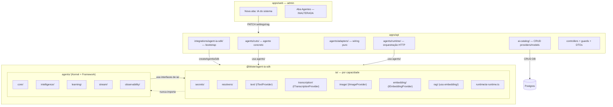
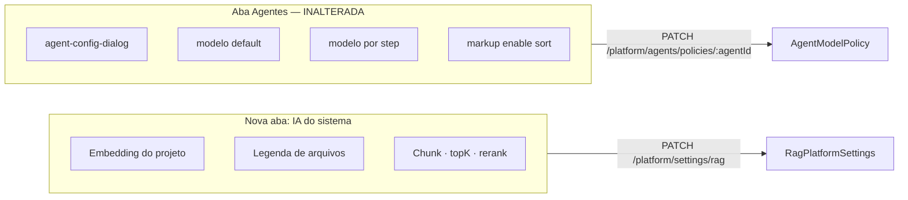

# @blister/agent-ia-sdk — Implementation Plan

> **Para agentes de execução:** REQUIRED SUB-SKILL: Use superpowers:subagent-driven-development (recomendado) ou superpowers:executing-plans para implementar task-by-task. Steps usam checkbox (`- [ ]`) para tracking.

**Goal:** Consolidar em [`packages/agent-ia-sdk`](packages/agent-ia-sdk) **toda** lógica de IA e agentes do backend. O módulo `ia/` é dividido por **capacidade** — `text/`, `transcription/`, `image/`, `embedding/`, `rag/` — cada um com sua interface e adapters próprios. O módulo `agents/` usa `ia/` via interfaces — nunca o contrário. `apps/api` vira shell HTTP puro. **Único agente ativo:** `cuts`.

**Architecture:** Backend bootstrap → `createAgentIaSdk({ prisma, secrets })` → SDK wira capacidades via `AdapterFactory` → `agents/` consome interfaces de `ia/` → backend orquestra HTTP e SSE apenas.

**Decisões confirmadas:**
- Package: `packages/agent-ia-sdk` (`@blister/agent-ia-sdk`)
- Um package, dois módulos internos: `ia/` e `agents/`
- `ia/` separado por capacidade: `text/`, `transcription/`, `image/`, `embedding/`, `rag/`
- `agents/` importa de `ia/` — `ia/` nunca importa de `agents/`
- **TUDO de IA** fica em `ia/`, organizado por capacidade
- Agente concreto `cuts` fica em `apps/api/src/agents/cuts/` usando o SDK como framework
- Agentes futuros (`research`, `video_editor`) — fora do escopo deste plano
- Credenciais: env/secrets — nunca Postgres
- `AiProviderCredential` removida do schema
- Admin UI: nova aba "IA do sistema" separada da aba Agentes (inalterada)

---

## Arquitetura em dois módulos



---

## Regra de fronteira (inviolável)

| Permitido em `apps/api` | Proibido em `apps/api` |
|-------------------------|------------------------|
| Controllers, guards, DTOs, Zod validation | Lógica LLM, embedding, RAG, transcrição, adapters HTTP de IA |
| `createAgentIaSdk()` via `AgentIaSdkModule` | `new OpenRouterAdapter()` fora do SDK |
| `ai-catalog`: CRUD providers, models, policies, RAG settings | `AiProviderCredential`, `encryptedValue`, credenciais no DB |
| Agente concreto `cuts` usando framework do SDK | Duplicar kernel/executor/stream do agente |
| `integrations/agent-ia-sdk/load-provider-secrets.ts` — único leitor de env para IA | `process.env.*_API_KEY` fora de `load-provider-secrets.ts` |

| Permitido no DB | Proibido no DB |
|-----------------|----------------|
| `AiModel`, `AiProvider`, policies, `RagPlatformSettings` | API keys, tokens, `encryptedValue`, credenciais |

| Regra interna ao SDK | |
|----------------------|--|
| `agents/` importa interfaces de `ia/text/`, `ia/transcription/`, `ia/image/`, `ia/embedding/` | OK |
| `agents/` instancia adapters concretos de `ia/` | **PROIBIDO** — só interfaces |
| `ia/rag/` usa `ia/embedding/` | OK |
| `ia/text/` usa `ia/transcription/` ou vice-versa | **PROIBIDO** — capacidades independentes |
| `ia/` importa de `agents/` | **PROIBIDO** |

---

## Estrutura alvo do package

```
packages/agent-ia-sdk/
  package.json              (@blister/agent-ia-sdk)
  tsconfig.json
  tsconfig.build.json
  vitest.config.ts
  src/
    index.ts                (re-exports ia + agents + factory + types)
    errors.ts               (ProviderNotConfiguredError, ModelNotFoundError, CapabilityNotConfiguredError, etc.)
    types.ts                (AgentIaSdk, ProviderSecrets)
    factory.ts              (createAgentIaSdk)

    ia/
      index.ts              (re-export de cada capacidade + runtime)

      secrets/
        provider-secrets.ts       (type ProviderSecrets)
        secrets-resolver.ts       (resolveProviderSecrets: slug → { apiKey, baseUrl? })

      resolvers/
        model-resolver.ts         (resolveModelById, resolveStepModel,
                                   resolvePlatformEmbeddingModel, resolvePlatformCaptionModel,
                                   calculateModelCost)

      text/                       ← geração de texto / chat / completion
        text-provider.ts          (ITextProvider interface: complete, stream)
        provider-error.util.ts    (parseProviderError, isRetryable)
        adapters/
          openrouter.adapter.ts   (implements ITextProvider)
          gemini.adapter.ts       (implements ITextProvider)
          index.ts

      transcription/              ← speech-to-text
        transcription-provider.ts (ITranscriptionProvider interface: transcribe)
        adapters/
          assemblyai-stt.adapter.ts (implements ITranscriptionProvider)
          index.ts

      image/                      ← geração de imagem (extensível — sem adapter ativo agora)
        image-provider.ts         (IImageProvider interface: generate)
        adapters/
          index.ts                (vazio — placeholder para futuros: DALL-E, Flux, etc.)

      embedding/                  ← vetores / embeddings
        embedding-provider.ts     (IEmbeddingProvider interface: embed)
        adapters/
          openrouter-embedding.adapter.ts (implements IEmbeddingProvider)
          gemini-embedding.adapter.ts     (implements IEmbeddingProvider)
          index.ts

      rag/                        ← pipeline RAG (usa ia/embedding/ internamente)
        document.service.ts
        chunk.service.ts
        embedding.repository.ts   (usa IEmbeddingProvider)
        ingestion.service.ts
        retrieval.service.ts
        caption.service.ts        (usa ITextProvider para gerar legenda)
        index.ts                  (RagService façade: { ingest, retrieve, caption })

      runtime/
        ai-runtime.ts             (AiRuntime façade: { text, transcription, image, embedding, rag })
        adapter-factory.ts        (AdapterFactory: resolve modelId → instancia adapter correto por capacidade)

    agents/
      index.ts
      clarification/
        clarification-field.ts
        clarification-flow.ts
      context/
        build-step-context.ts
      core/
        agent-builder.ts
        agent-registry.ts
        agent-runtime-types.ts
        checkpoint.ts
        default-step-runner.ts
        execute-run.ts
        run-store.ts
        types.ts
      intelligence/
        adaptive-brief.ts
        analyze-request.ts        (recebe ITextProvider via parâmetro — nunca instancia adapter)
        analysis-prompt.ts
      learning/
        learning-registry.ts
      memory/
        memory-provider.ts
      middleware/
        types.ts
      observability/
        telemetry.ts
        run-snapshot.ts
      routing/
        routing.ts
      schemas/
        define-agent-schemas.ts
        clarification-answer.ts
        normalizer.ts
        parse-llm-json.ts
        request-analysis.ts
        validate-step-output.ts
        validator.ts
        zod-to-json-schema.ts
      steps/
        cache.ts
        create-image-generation-step.ts   (usa IImageProvider via parâmetro)
        create-pause-step.ts
      stream/
        block-emitter.ts
        run-events.ts
      testing/
        agent-test-harness.ts
        harness-flows.ts
        step-test-harness.ts
        fixtures/
        matchers/
        stubs/
      tools/
        create-tool-step.ts
        tool-registry.ts
      usage/
        usage-reporter.ts
```

### Interfaces por capacidade

```typescript
// ia/text/text-provider.ts
export interface ITextProvider {
  complete(params: TextCompleteParams): Promise<TextResult>;
  stream(params: TextCompleteParams): AsyncIterable<TextChunk>;
}

// ia/transcription/transcription-provider.ts
export interface ITranscriptionProvider {
  transcribe(params: TranscribeParams): Promise<TranscriptionResult>;
}

// ia/image/image-provider.ts
export interface IImageProvider {
  generate(params: ImageGenerateParams): Promise<ImageResult>;
}

// ia/embedding/embedding-provider.ts
export interface IEmbeddingProvider {
  embed(texts: string[]): Promise<number[][]>;
}

// ia/runtime/ai-runtime.ts
export interface AiRuntime {
  text: ITextProvider;
  transcription: ITranscriptionProvider;
  image: IImageProvider;
  embedding: IEmbeddingProvider;
  rag: RagService;
}
```

### AdapterFactory — resolução por capacidade

```typescript
// ia/runtime/adapter-factory.ts
export class AdapterFactory {
  // resolve model → provider slug → secrets → adapter concreto por capacidade
  createText(prisma, secrets, { agentId, stepKey }): ITextProvider
  createTranscription(prisma, secrets): ITranscriptionProvider
  createEmbedding(prisma, secrets): IEmbeddingProvider
  createImage(prisma, secrets): IImageProvider
}
```

---

## O que SOBREVIVE / DELETAR em `apps/api`

### Mantém
- `agents/cuts/` — agente concreto (steps, prompts, learning handler — usa SDK como framework)
- `agents/runtime/` — orquestração HTTP (SSE, workflow-engine, review, credits)
- `agents/adapters/prisma-run-store.adapter.ts` — wiring puro
- `agents/adapters/sdk-step.adapter.ts` — wiring puro
- `agents/adapters/usage-reporter.adapter.ts` — wiring puro
- `agents/adapters/memory-provider.adapter.ts` — wiring puro
- `agents/agent-catalog.controller.ts`, `agent-runs.controller.ts`
- `ai-catalog/` — CRUD completo de providers, models, policies
- `platform/`, `auth/`, `credits/`, `files/`, `company/`, `marketplace/`, `audit/`
- `integrations/agent-ia-sdk/` — bootstrap NestJS (novo)

### Deletar
- `src/ai-runtime/` — inteiro (migrado para SDK)
- `src/rag/` — inteiro (migrado para SDK)
- `agents/adapters/context-pack-builder.adapter.ts` — lógica de IA, move para SDK
- `agents/adapters/brand-profile.mapper.ts` — lógica de IA, move para SDK
- `agents/adapters/asset-resolver.adapter.ts` — lógica de IA, move para SDK
- `agents/runtime/kernel/trigger-providers.ts` — move para integration module
- Referências a `AiProviderCredential` em qualquer arquivo

### Shell NestJS (novo)
```
apps/api/src/integrations/agent-ia-sdk/
  load-provider-secrets.ts      ← único leitor de process.env para IA
  agent-ia-sdk.module.ts
  agent-ia-sdk.token.ts         (AGENT_IA_SDK symbol)
```

```typescript
// agent-ia-sdk.module.ts
@Global()
@Module({
  providers: [{
    provide: AGENT_IA_SDK,
    useFactory: (prisma: PrismaService, config: ConfigService) =>
      createAgentIaSdk({ prisma, secrets: loadProviderSecrets(config) }),
    inject: [PrismaService, ConfigService],
  }],
  exports: [AGENT_IA_SDK],
})
export class AgentIaSdkModule {}
```

### Factory (SDK)
```typescript
// packages/agent-ia-sdk/src/factory.ts
export function createAgentIaSdk(deps: {
  prisma: PrismaClient;
  secrets: ProviderSecrets;
}): AgentIaSdk; // { ia: AiRuntime; agents: AgentRuntime }

// apps/api/src/integrations/agent-ia-sdk/load-provider-secrets.ts
export const loadProviderSecrets = (config: ConfigService): ProviderSecrets => ({
  openrouter: {
    apiKey: config.get('OPENROUTER_API_KEY') ?? '',
    baseUrl: config.get('OPENROUTER_BASE_URL'),
    httpReferer: config.get('OPENROUTER_HTTP_REFERER'),
    appTitle: config.get('OPENROUTER_APP_TITLE'),
  },
  gemini: {
    apiKey: config.get('GEMINI_API_KEY') ?? '',
    baseUrl: config.get('GEMINI_BASE_URL'),
  },
  assemblyai: {
    apiKey: config.get('ASSEMBLYAI_API_KEY') ?? '',
    llmGatewayBaseUrl: config.get('ASSEMBLYAI_LLM_GATEWAY_BASE_URL'),
    sttBaseUrl: config.get('ASSEMBLYAI_BASE_URL'),
  },
});
```

---

## Admin UI: duas áreas separadas



### Aba **IA do sistema** (nova — escopo deste plano)

```
┌─ IA do sistema ──────────────────────────────────────────────────┐
│  Embedding do projeto *    [ AgentModelSelect (filterEmbedding) ] │
│  Legenda de arquivos       [ AgentModelSelect (filterText) ][Limpar]│
│  ── Indexação e recuperação ──                                    │
│  Chunk size · overlap · top-K · rerank                           │
│                               [ Salvar configurações ]           │
└──────────────────────────────────────────────────────────────────┘
```

| Slot | Filtro | Persistência |
|------|--------|--------------|
| Embedding (RAG) | `filterEmbeddingModels` | `RagPlatformSettings.embeddingModelId` |
| Legenda de arquivos | `filterTextModels` | `RagPlatformSettings.captionModelId` |
| Chunk, overlap, topK, rerank | inputs numéricos | `RagPlatformSettings` |

**Aba Agentes — não mexer:**

| Manter como está | Não fazer neste plano |
|------------------|-----------------------|
| `agents-platform-tab.tsx` | Mover modelos para aba global |
| `agent-config-dialog.tsx` (default, steps, markup) | Remover `AgentModelSelect` do dialog |
| `PATCH /platform/agents/policies/:agentId` | Criar endpoint batch unificado |

---

## Fases e Tasks

### Task 1: Scaffold `packages/agent-ia-sdk`

**Files:**
- Create: `packages/agent-ia-sdk/package.json`
- Create: `packages/agent-ia-sdk/tsconfig.json`
- Create: `packages/agent-ia-sdk/tsconfig.build.json`
- Create: `packages/agent-ia-sdk/vitest.config.ts`
- Create: `packages/agent-ia-sdk/src/index.ts`
- Create: `packages/agent-ia-sdk/src/errors.ts`
- Create: `packages/agent-ia-sdk/src/types.ts`
- Create: `packages/agent-ia-sdk/src/factory.ts`
- Modify: `pnpm-workspace.yaml` — adicionar `packages/agent-ia-sdk`
- Modify: `turbo.json` — incluir novo package no pipeline

- [x] Criar estrutura de pastas: `src/ia/text/`, `src/ia/transcription/`, `src/ia/image/`, `src/ia/embedding/`, `src/ia/rag/`, `src/ia/secrets/`, `src/ia/resolvers/`, `src/ia/runtime/`, `src/agents/`
- [x] `package.json` com `name: "@company-os/agent-ia-sdk"` _(namespace real do repo; o plano dizia `@blister/` que não existe)_, deps: `@company-os/db`, `@company-os/types`, `zod` _(usa `@company-os/db` em vez de `@prisma/client` — ver nota Prisma abaixo)_
- [x] `tsconfig.json` extendendo `../../tsconfig.base.json` _(o repo não usa `@blister/configs/tsconfig.base.json`)_
- [x] `vitest.config.ts` com `globals: true`, `environment: 'node'`
- [x] `errors.ts`: `ProviderNotConfiguredError`, `ModelNotFoundError`, `CapabilityNotConfiguredError`, `EmbeddingModelNotConfiguredError`
- [x] `types.ts`: `ProviderSecrets` _(completo)_, `AgentIaSdk` (placeholder em `factory.ts`, refinado na Task 8/9)
- [x] Verificar `pnpm install` sem erros

> **Nota Prisma (decisão do usuário — Shared `packages/db`):** o client Prisma era gerado em path custom (`apps/api/src/generated/prisma`), inacessível a um package standalone. Criado `packages/db` (`@company-os/db`) como fonte única: o `generator` agora emite em `packages/db/src/generated/client`, `packages/db/src/index.ts` re-exporta, e **todos** os imports `generated/prisma` em `apps/api` (~57 arquivos) foram reescritos para `@company-os/db`. Removidos `scripts/sync-prisma-dist.cjs` e o asset `generated/prisma` do `nest-cli.json` (client agora resolve via symlink de workspace). Verificado: `apps/api` typecheck sem novos erros (2 erros pré-existentes em specs, não relacionados).

---

### Task 2: `ia/secrets/` + `ia/resolvers/`

**Files:**
- Create: `packages/agent-ia-sdk/src/ia/secrets/provider-secrets.ts`
- Create: `packages/agent-ia-sdk/src/ia/secrets/secrets-resolver.ts`
- Create: `packages/agent-ia-sdk/src/ia/secrets/secrets-resolver.spec.ts`
- Create: `packages/agent-ia-sdk/src/ia/resolvers/model-resolver.ts`
- Create: `packages/agent-ia-sdk/src/ia/resolvers/model-resolver.spec.ts`
- Source: Migrar de `apps/api/src/ai-runtime/resolve-model.ts`, `apps/api/src/ai-runtime/platform-model-resolver.ts`

- [x] `provider-secrets.ts`: type `ProviderSecrets` com campos opcionais `openrouter`, `gemini`, `assemblyai` _(canônico em `types.ts`, re-exportado aqui)_
- [x] `secrets-resolver.ts`: `resolveProviderSecrets(secrets, slug)` → `{ apiKey, baseUrl? }`
  - Throw `ProviderNotConfiguredError` se `apiKey` vazia — mensagem cita env var esperada
  - Suporte: `'openrouter'`, `'gemini'`, `'assemblyai'`; throw para slug desconhecido
- [x] `secrets-resolver.spec.ts`: key presente → retorna; key vazia → throw; slug desconhecido → throw
- [x] `model-resolver.ts`:
  - `resolveModelById(prisma, modelId)` → `ResolvedModel` — throw `ModelNotFoundError` se não encontrado/desabilitado
  - `resolveStepModel(prisma, { agentId, stepKey })` → step policy → fallback agent policy → throw se nenhum
  - `resolveStepSpeechModel(prisma, { agentId, stepKey })` → externalId de step policy `speech` ou `undefined` _(migrado p/ STT da Task 4)_
  - `resolvePlatformEmbeddingModel(prisma)` → throw `EmbeddingModelNotConfiguredError` se null/desabilitado
  - `resolvePlatformCaptionModel(prisma)` → nullable
  - `calculateModelCost(model, usage)` → pricing de `AiModel`
- [x] **Sem** `DEFAULT_EMBEDDING_MODEL`, **sem** fallback hardcoded
- [x] `model-resolver.spec.ts`: todos os cenários de throw _(16 testes verdes)_

---

### Task 3: `ia/text/` — ITextProvider + adapters

**Files:**
- Create: `packages/agent-ia-sdk/src/ia/text/text-provider.ts`
- Create: `packages/agent-ia-sdk/src/ia/text/provider-error.util.ts`
- Create: `packages/agent-ia-sdk/src/ia/text/adapters/openrouter.adapter.ts`
- Create: `packages/agent-ia-sdk/src/ia/text/adapters/gemini.adapter.ts`
- Create: `packages/agent-ia-sdk/src/ia/text/adapters/index.ts`
- Create: `packages/agent-ia-sdk/src/ia/text/index.ts`
- Source: Migrar de `apps/api/src/ai-runtime/adapters/openrouter.adapter.ts`, `apps/api/src/ai-runtime/adapters/gemini.adapter.ts`, `apps/api/src/ai-runtime/provider-error.util.ts`

- [x] `text-provider.ts`: interface `ITextProvider { complete(params): Promise<TextResult>; stream(params): AsyncGenerator<TextChunk, TextResult> }` _(generator preserva usage final)_
- [x] `provider-error.util.ts`: `parseProviderError`, `isRetryable` _(+ `ProviderExecutionError`/`mapProviderErrorCategory` em `errors.ts` raiz, compartilhado entre capacidades)_
- [x] `openrouter.adapter.ts`: `OpenRouterTextAdapter` construtor `{ apiKey, baseUrl?, httpReferer?, appTitle? }` — implements `ITextProvider`
- [x] `gemini.adapter.ts`: `GeminiTextAdapter` construtor `{ apiKey, baseUrl? }` — implements `ITextProvider`
- [x] `text/index.ts`: exportar interface + adapters

---

### Task 4: `ia/transcription/` — ITranscriptionProvider + AssemblyAI STT

**Files:**
- Create: `packages/agent-ia-sdk/src/ia/transcription/transcription-provider.ts`
- Create: `packages/agent-ia-sdk/src/ia/transcription/adapters/assemblyai-stt.adapter.ts`
- Create: `packages/agent-ia-sdk/src/ia/transcription/adapters/index.ts`
- Create: `packages/agent-ia-sdk/src/ia/transcription/index.ts`
- Source: Extrair lógica STT de `apps/api/src/agents/cuts/build-cuts-run-deps.ts` + `apps/api/src/ai-runtime/adapters/assemblyai.adapter.ts`

- [x] `transcription-provider.ts`: interface `ITranscriptionProvider { transcribe(params: TranscribeParams): Promise<TranscriptionResult> }`
  - `TranscribeParams`: `{ audioUrl: string; language?: string; speechModels? }`
  - `TranscriptionResult`: `{ text: string; segments: TranscriptSegment[]; words?: WordTimestamp[]; duration? }` _(adicionado `segments` em ms — cuts ranqueia por eles)_
- [x] `assemblyai-stt.adapter.ts`: `AssemblyAiSttAdapter` construtor `{ apiKey, sttBaseUrl? }` — implements `ITranscriptionProvider`; helpers `buildTimedSegmentsFromWords`/`resolveTimedSegments` migrados
- [x] `transcription/index.ts`: exportar interface + adapters

---

### Task 5: `ia/image/` — IImageProvider (scaffold extensível)

**Files:**
- Create: `packages/agent-ia-sdk/src/ia/image/image-provider.ts`
- Create: `packages/agent-ia-sdk/src/ia/image/adapters/index.ts`
- Create: `packages/agent-ia-sdk/src/ia/image/index.ts`

- [x] `image-provider.ts`: interface `IImageProvider { generate(params: ImageGenerateParams): Promise<ImageResult> }`
  - `ImageGenerateParams`: `{ prompt: string; size?: string; n?: number }`
  - `ImageResult`: `{ url: string; b64?: string }`
- [x] `adapters/index.ts`: vazio — placeholder para DALL-E, Flux, etc.
- [x] Sem adapter ativo por ora — scaffold suficiente para `create-image-generation-step.ts` em `agents/`
- [x] `image/index.ts`: exportar interface

---

### Task 6: `ia/embedding/` — IEmbeddingProvider + adapters

**Files:**
- Create: `packages/agent-ia-sdk/src/ia/embedding/embedding-provider.ts`
- Create: `packages/agent-ia-sdk/src/ia/embedding/adapters/openrouter-embedding.adapter.ts`
- Create: `packages/agent-ia-sdk/src/ia/embedding/adapters/gemini-embedding.adapter.ts`
- Create: `packages/agent-ia-sdk/src/ia/embedding/adapters/index.ts`
- Create: `packages/agent-ia-sdk/src/ia/embedding/index.ts`
- Source: Extrair de `apps/api/src/ai-runtime/embedding.service.ts`, `apps/api/src/ai-runtime/adapters/`

- [x] `embedding-provider.ts`: interface `IEmbeddingProvider { embed(texts: string[]): Promise<number[][]> }` _(+ `model`/`dimensions` readonly, fixados na construção)_
- [x] `openrouter-embedding.adapter.ts`: `OpenRouterEmbeddingAdapter` construtor `{ apiKey, model, baseUrl?, dimensions? }` — implements `IEmbeddingProvider`
- [x] `gemini-embedding.adapter.ts`: `GeminiEmbeddingAdapter` construtor `{ apiKey, model, baseUrl?, dimensions? }` — implements `IEmbeddingProvider`
- [x] `embedding/index.ts`: exportar interface + adapters

---

### Task 7: `ia/rag/` — RAG completo usando `ia/embedding/`

**Files:**
- Create: `packages/agent-ia-sdk/src/ia/rag/document.service.ts`
- Create: `packages/agent-ia-sdk/src/ia/rag/chunk.service.ts`
- Create: `packages/agent-ia-sdk/src/ia/rag/embedding.repository.ts`
- Create: `packages/agent-ia-sdk/src/ia/rag/ingestion.service.ts`
- Create: `packages/agent-ia-sdk/src/ia/rag/retrieval.service.ts`
- Create: `packages/agent-ia-sdk/src/ia/rag/caption.service.ts`
- Create: `packages/agent-ia-sdk/src/ia/rag/index.ts`
- Source: Migrar de `apps/api/src/rag/*`

- [x] Migrar cada service de `apps/api/src/rag/` substituindo injeção NestJS por parâmetros no construtor _(query pgvector `Prisma.sql` migra verbatim via `@company-os/db`)_
- [x] `embedding.repository.ts`: recebe `IEmbeddingProvider` — não importa adapter concreto
- [x] `caption.service.ts`: recebe `ITextProvider` — não importa adapter concreto _(visão via `images` em `TextCompleteParams`)_
- [x] `retrieval.service.ts`: recebe `EmbeddingRepository` (que recebe `IEmbeddingProvider`) — `searchBrandBrain` removido (regra "Sem Cérebro da Marca")
- [x] `ingestion.service.ts`: recebe `{ prisma, documentService, chunkService, embeddingRepository }`
- [x] `rag/index.ts`: `RagService` façade `{ ingest, retrieve, caption }` resolve providers por-operação (`resolveEmbedding`/`resolveCaption`) p/ refletir mudanças do admin sem restart

---

### Task 8: `ia/runtime/` — AiRuntime façade + AdapterFactory

**Files:**
- Create: `packages/agent-ia-sdk/src/ia/runtime/adapter-factory.ts`
- Create: `packages/agent-ia-sdk/src/ia/runtime/ai-runtime.ts`
- Create: `packages/agent-ia-sdk/src/ia/index.ts`
- Source: Migrar de `apps/api/src/ai-runtime/ai-runtime.service.ts`, `apps/api/src/ai-runtime/platform-ai.client.ts`

- [x] `adapter-factory.ts`: `AdapterFactory(prisma, secrets)` — wira resolvers + secrets para instanciar adapter por capacidade
  - `createText({ agentId, stepKey }): Promise<BoundTextProvider>` _(model bound do policy resolvido)_
  - `createTranscription(): ITranscriptionProvider`
  - `createEmbedding(): Promise<IEmbeddingProvider>`; `createCaption(): Promise<{provider,model}|null>`
  - `createImage(): IImageProvider` _(lança `CapabilityNotConfiguredError`)_
- [x] `ai-runtime.ts`: `AiRuntime { factory, rag, text(), transcription(), embedding(), image() }` — construtor `{ prisma, secrets }` _(text/embedding são métodos: resolvem model por-chamada p/ refletir admin)_
- [x] `ia/index.ts`: re-exporta interfaces de cada capacidade + `RagService` + resolvers + `AiRuntime` + `AdapterFactory`; **não** exporta adapters concretos
- [x] `factory.ts`: `createAgentIaSdk` agora constrói `ia: new AiRuntime(...)`; `index.ts` faz `export * from './ia'`. Build + 16 testes verdes.

---

### Task 9: `agents/` — Migrar `packages/agent-sdk`

**Files:**
- Create: `packages/agent-ia-sdk/src/agents/` (estrutura completa)
- Source: Todo `packages/agent-sdk/src/`
- Modify: `packages/agent-sdk/package.json` — marcar como deprecated

- [x] Copiar todo `packages/agent-sdk/src/` → `packages/agent-ia-sdk/src/agents/` (69 arquivos)
- [x] Ajustar imports relativos internos — preservados (estrutura interna idêntica), nenhuma reescrita necessária
- [~] `intelligence/analyze-request.ts` / `adaptive-brief.ts` / `steps/create-image-generation-step.ts`: **DESVIO deliberado** — mantidos os ports próprios do framework (`LlmProvider`/`ImageProvider`, que **já são interfaces**, não adapters) em vez de trocar por `ITextProvider`/`IImageProvider`. Razão: o boundary ("agents/ não usa adapters concretos") já é satisfeito; trocar os nomes das interfaces forçaria mudança em cascata no kernel/executor (69 arquivos) sem ganho de desacoplamento. A ponte `ia.ITextProvider → LlmProvider` é feita no shell (`sdk-step.adapter`, Task 12).
- [x] `agents/index.ts`: re-exporta tudo (é o `index.ts` migrado do agent-sdk)
- [x] `agents/` **não importa** adapter concreto de `ia/*/adapters/` — verificado (só importa `zod`, `@company-os/types`, `node:*`)
- [x] Verificar: nenhum import de `@company-os/agent-sdk` restante em `apps/api` (reescrito p/ `@company-os/agent-ia-sdk/agents`)
- [x] `apps/api/package.json`: adicionado `@company-os/agent-ia-sdk` (subpaths via `typesVersions`: classic `Node` moduleResolution não lê `exports`)
- [x] `packages/agent-sdk/package.json`: marcado `"deprecated"` — mantido até Task 15

> **Nota:** `apps/api` typecheck ainda mostra erros em `asset-resolver`/`brand-profile.mapper`/`context-pack-builder`/kernel/sdk-step/prisma-run-store — são exatamente os arquivos que a **Task 12** deleta/religa (símbolos `AssetResolver`/`ContextPackBuilder`/`BrandProfile`/`StoredRun.brandProfile` removidos no refactor "remove Brand Brain", antes mascarados por dist obsoleto do agent-sdk). Esperado pela ordem do plano; `apps/api` fica verde na Task 12.

---

### Task 10: Remover `AiProviderCredential` do DB

**Files:**
- Modify: `apps/api/prisma/schema.prisma`
- Create: `apps/api/prisma/migrations/YYYYMMDD_drop_ai_provider_credential/migration.sql`
- Modify: `apps/api/src/ai-catalog/providers.service.ts`
- Modify: `packages/types/src/ai-catalog.ts`

- [x] `schema.prisma`: removido model `AiProviderCredential` e relação `credentials AiProviderCredential[]` em `AiProvider`
- [x] Migration SQL: `20260622120000_drop_ai_provider_credential/migration.sql` → `DROP TABLE IF EXISTS "AiProviderCredential";`
- [x] `providers.service.ts`: removidos `addCredential()`/`deleteCredential()` e o `include: { credentials }` no `findAll()`
- [x] Removidas rotas `POST .../credentials` e `DELETE .../credentials/:credId` do controller (+ import `addCredentialSchema`)
- [x] `packages/types/src/ai-catalog.ts` + `dto/ai-catalog.dto.ts`: removido `addCredentialSchema`/`AddCredentialDto` _(não havia `AiProviderCredentialDto`)_
- [x] Seed/test-seed: verificado — nenhuma inserção de `AiProviderCredential` existia. Prisma client regenerado; `@company-os/types` typecheck verde.

---

### Task 11: `apps/api` — Integration module NestJS

**Files:**
- Create: `apps/api/src/integrations/agent-ia-sdk/load-provider-secrets.ts`
- Create: `apps/api/src/integrations/agent-ia-sdk/agent-ia-sdk.token.ts`
- Create: `apps/api/src/integrations/agent-ia-sdk/agent-ia-sdk.module.ts`
- Modify: `apps/api/src/app.module.ts`

- [x] `agent-ia-sdk.token.ts`: `export const AGENT_IA_SDK = Symbol('AGENT_IA_SDK');` (+ `AgentIaSdkRef` type alias)
- [x] `load-provider-secrets.ts`: única função que lê `ConfigService` para IA — nenhum outro arquivo pode fazer isso
  ```typescript
  export const loadProviderSecrets = (config: ConfigService): ProviderSecrets => ({
    openrouter: {
      apiKey: config.get('OPENROUTER_API_KEY') ?? '',
      baseUrl: config.get('OPENROUTER_BASE_URL'),
      httpReferer: config.get('OPENROUTER_HTTP_REFERER'),
      appTitle: config.get('OPENROUTER_APP_TITLE'),
    },
    gemini: {
      apiKey: config.get('GEMINI_API_KEY') ?? '',
      baseUrl: config.get('GEMINI_BASE_URL'),
    },
    assemblyai: {
      apiKey: config.get('ASSEMBLYAI_API_KEY') ?? '',
      llmGatewayBaseUrl: config.get('ASSEMBLYAI_LLM_GATEWAY_BASE_URL'),
      sttBaseUrl: config.get('ASSEMBLYAI_BASE_URL'),
    },
  });
  ```
- [x] `agent-ia-sdk.module.ts`: `@Global()` provider com `useFactory` (injeta `PrismaService` + `ConfigService`)
- [x] `app.module.ts`: importado `AgentIaSdkModule` _(remoção de `AiRuntimeModule`/`RagModule` adiada p/ Task 12, após religar consumidores — evita DI quebrado intermediário)_
- [x] `AGENT_IA_SDK` disponível globalmente via `@Inject(AGENT_IA_SDK)` (`@Global` module)

---

### Task 12: `apps/api` — Shell: rewire adapters + deletar legado

**Files:**
- Modify: `apps/api/src/agents/adapters/prisma-run-store.adapter.ts`
- Modify: `apps/api/src/agents/adapters/sdk-step.adapter.ts`
- Modify: `apps/api/src/agents/adapters/usage-reporter.adapter.ts`
- Modify: `apps/api/src/agents/adapters/memory-provider.adapter.ts`
- Modify: `apps/api/src/agents/runtime/kernel/agent-execution.kernel.ts`
- Modify: `apps/api/src/agents/runtime/workflow-engine.service.ts`
- Modify: `apps/api/src/agents/cuts/build-cuts-run-deps.ts`
- Delete: `apps/api/src/ai-runtime/` (pasta inteira)
- Delete: `apps/api/src/rag/` (pasta inteira)
- Delete: `apps/api/src/agents/adapters/context-pack-builder.adapter.ts`
- Delete: `apps/api/src/agents/adapters/brand-profile.mapper.ts`
- Delete: `apps/api/src/agents/adapters/asset-resolver.adapter.ts`
- Delete: `apps/api/src/agents/runtime/kernel/trigger-providers.ts`

- [x] `prisma-run-store.adapter.ts`: já usava `@company-os/agent-ia-sdk/agents`; removidos `brandProfile`/`mapBrandProfile` e o include `company.brandProfile` (SDK `StoredRun` não tem mais `brandProfile`)
- [x] `sdk-step.adapter.ts`: removido `assetResolver` (SDK `StepExecutorRuntimeDeps` só tem `llmProvider`/`imageProvider`/`message`)
- [x] `usage-reporter.adapter.ts`, `memory-provider.adapter.ts`: wiring puro — sem mudança necessária
- [x] `agent-execution.kernel.ts`: removidos `contextPackBuilder`/`assetResolver` (saíram do SDK com Brand Brain); `formatProviderError` aponta p/ novo `provider-error-message.ts` no shell (usa `ProviderExecutionError` do SDK)
- [x] `trigger-providers.ts`: `createTriggerLlmProvider(sdk)` faz a ponte `sdk.ia.text` → `LlmProvider` (custo via `calculateModelCost(provider.resolved)`) — SDK ganhou `BoundTextProvider.resolved`
- [x] `build-cuts-run-deps.ts`: usa `sdk.ia.transcription()` para STT; `resolveStepSpeechModel` do SDK; assina `(prisma, storage, sdk)`; `buildCutsRunDepsFromEnv` constrói o SDK do env. Spec reescrito.
- [x] `workflow-engine.service.ts` + `cuts-run-deps.adapter.ts`: injetam `@Inject(AGENT_IA_SDK)`; trigger `agent-run-execute.ts` constrói o SDK do env
- [x] triggers `rag-index-document.ts` (→ `sdk.ia.rag.ingest`) e `enrich-campaign-files.ts` (→ `sdk.ia.rag.caption`) religados
- [x] Grep limpo → deletados `src/ai-runtime/`, `src/rag/`, `context-pack-builder.adapter.ts`, `brand-profile.mapper.ts`, `asset-resolver.adapter.ts`
- [x] `AiRuntimeModule` removido de `app.module.ts` + `agents.module.ts` (`RagModule` não tinha consumidores)
- [x] `pnpm build` (nest) sem erros de TypeScript. _(Typecheck full ainda tem 2 erros pré-existentes em `feedback-handler.spec.ts` — `extractInsights` opcional — fora de escopo, vermelhos desde o baseline; excluídos do build.)_

---

### Task 13: API — RAG settings globais

**Files:**
- Modify: `packages/types/src/ai-catalog.ts`
- Modify: `apps/api/src/ai-catalog/platform-settings.service.ts`
- Modify: `apps/api/src/platform/platform.controller.ts` (ou controller relevante)

- [x] `packages/types/src/ai-catalog.ts` + `dto/ai-catalog.dto.ts`: `updateRagSettingsSchema` (+ `ragPlatformSettingsSchema`/`RagPlatformSettings` type)
  - **Desvio:** `z.string().min(1)` em vez de `.uuid()` — ids de `AiModel` são **cuid**, não uuid; `.uuid()` rejeitaria ids válidos
  - **Desvio:** campo `rerankEnabled` (não `rerank`) — casa com a coluna `RagPlatformSettings.rerankEnabled`, sem mapeamento
- [x] `platform-settings.service.ts`: `getRagSettings()`, `updateRagSettings(dto)`
  - `assertModelCapability`: embedding slot exige capability `embedding`; caption slot exige `text`; modelo ausente/desabilitado → 422
- [x] `GET /platform/settings` → `{ credits, rag }`
- [x] `PATCH /platform/settings/rag` → `@RequirePlatformRole('platform_admin')` _(o repo usa platform roles, não `@RequirePermission`)_
- [x] **Não** criado endpoint batch com agentes
- [x] Testes: `platform-settings.service.spec.ts` — embeddingModelId inválido/sem capability → 422 (UnprocessableEntity); válido → persiste+audita. 5 testes verdes.

---

### Task 14: Admin UI — Aba "IA do sistema"

**Files:**
- Create: `apps/web/src/core/modules/platform-admin/components/system-ai-tab.tsx`
- Create: `apps/web/src/core/modules/platform-admin/hooks/use-platform-rag-settings.ts`
- Modify: `apps/web/src/core/modules/platform-admin/hooks/use-platform-admin-tab.ts`
- Modify: `apps/web/src/core/modules/platform-admin/components/platform-admin-primitives.tsx`
- Modify: `apps/web/src/core/modules/platform-admin/pages/platform-admin-page.tsx`
- Modify: `apps/web/messages/pt-BR.json`
- Modify: `apps/web/messages/en.json`

- [x] `use-platform-rag-settings.ts`: `useRagSettings()` (via cache `usePlatformSettings`), `useUpdateRagSettings()` (PATCH)
  - **Desvio:** sem `queryKey: ['platform','rag-settings']` separada — RAG vem de `GET /platform/settings` junto com créditos; invalida `['platform','settings']` no `onSuccess`
- [x] `system-ai-tab.tsx`: RHF + `updateRagSettingsSchema` (required + coerce), `mode: 'onBlur'`
  - `AgentModelSelect` + `filterEmbeddingModels` / `filterTextModels`, botão Limpar caption, numéricos, toggle `rerankEnabled`, submit disabled se `!isDirty`
- [x] Tab `system-ai` em `use-platform-admin-tab.ts`
- [x] Nav **IA do sistema** em `platform-admin-primitives.tsx` — ícone **Sparkles** _(Cpu já usado no AI Catalog)_
- [x] `platform-admin-page.tsx` renderiza `<SystemAiTab />`
- [x] i18n `pt-BR.json` + `en.json`: `platformAdmin.systemAiPage`, `platformAdmin.systemAiTab`
- [x] **Não alterado** `agents-platform-tab.tsx`, `agent-config-dialog.tsx`
- [x] `apps/web` typecheck limpo

---

### Task 15: Enforcement, testes e docs

**Files:**
- Create: `scripts/check-ai-boundaries.sh`
- Modify: `apps/api/prisma/seed.ts`
- Create: `docs/decisions/2026-06-22-agent-ia-sdk.md` (ADR)
- Modify: `docs/project/current-state.md`

- [x] `scripts/check-ai-boundaries.sh` + `scripts/check-ai-boundaries.mjs` (Windows/CI)
- [x] Root `package.json`: `pnpm check:ai-boundaries` — wire em CI quando pipeline existir
- [x] Seed: `seed.ts` + `seed-ai-catalog.ts` — providers/models, `RagPlatformSettings`, `AgentModelPolicy` cuts, sem credenciais DB
- [x] ADR `docs/decisions/2026-06-22-agent-ia-sdk.md`
- [x] `docs/project/current-state.md` atualizado
- [x] `@company-os/agent-sdk` — re-export shim → `agent-ia-sdk/agents`; removido de `apps/api` deps; Dockerfile/start:dev usam `agent-ia-sdk`

---

## Ordem de execução

```
Task 1 (scaffold package)
  ↓
Task 2 (secrets/ + resolvers/ — base de tudo)
  ↓
Task 3 + Task 4 + Task 5 + Task 6 (text, transcription, image, embedding — paralelo)
  ↓
Task 7 (rag/ — depende de embedding/ e text/)
  ↓
Task 8 (ia/runtime/ — AiRuntime façade — depende de todas as capacidades)
  ↓
Task 9 (agents/ — migrar agent-sdk — depende de interfaces de ia/)
  ↓
Task 10 (drop AiProviderCredential — sem dependentes restantes)
  ↓
Task 11 (integration module NestJS — wira SDK no backend)
  ↓
Task 12 (rewire + deletar legado — depende de Task 11)
  ↓
Task 13 + Task 14 (API rag settings + Admin UI — paralelo após Task 12)
  ↓
Task 15 (enforcement + docs)
```

---

## Riscos

| Risco | Mitigação |
|-------|-----------|
| `intelligence/` usa texto — risco de import circular via adapter concreto | Receber `ITextProvider` como parâmetro; nunca instanciar dentro de `agents/` |
| `rag/caption.service.ts` usa texto — mesma vulnerabilidade | Receber `ITextProvider` no construtor; `AdapterFactory` wira na Task 8 |
| Admin escolhe modelo Gemini mas env sem key | `ProviderNotConfiguredError` claro no runtime + badge na UI |
| `packages/agent-sdk` ainda importado em arquivo esquecido | Grep em CI + remover `@blister/agent-sdk` do `package.json` de `apps/api` na Task 9 |
| Migration drop `AiProviderCredential` com dados reais | Rodar em dev/staging primeiro |
| `cuts/build-cuts-run-deps.ts` com deps de STT — path complexo | STT migrado para `ia/transcription/` na Task 4; build-cuts usa `sdk.ia.transcription` |
| Capacidade `image/` sem adapter ativo quebra runtime | `AdapterFactory.createImage()` lança `CapabilityNotConfiguredError` se chamado sem adapter — agente que usa imagem deve checar antes |
| Múltiplos lugares lendo env para IA | Enforcement grep na Task 15: zero `process.env.*_API_KEY` fora de `load-provider-secrets.ts` |

---

## Regras invioláveis pós-migração

1. **Um package** — `@blister/agent-ia-sdk` — dono exclusivo de toda lógica de IA e agentes
2. **`ia/` separado por capacidade** — `text/`, `transcription/`, `image/`, `embedding/`, `rag/` — cada um independente com sua interface
3. **`agents/` usa interfaces, nunca adapters concretos** — `ITextProvider`, `ITranscriptionProvider`, `IImageProvider`, `IEmbeddingProvider`
4. **`ia/` nunca importa `agents/`** — dependência unidirecional
5. **Capacidades `ia/` são independentes entre si** — `ia/text/` não importa `ia/transcription/`; `ia/rag/` só usa interfaces de `ia/embedding/` e `ia/text/`
6. **Backend = shell** — controllers, guards, DTOs, wiring apenas; zero lógica de IA
7. **Credenciais em env** — `load-provider-secrets.ts` é o único leitor; zero no Postgres
8. **Admin escolhe modelo** — sempre via `modelId`; provider é implícito no catálogo
9. **Admin UI separada** — aba IA do sistema ≠ aba Agentes; sem merge
10. **Agente ativo: somente `cuts`** — futuros agentes seguirão o mesmo padrão quando criados
11. **Seed editável** — runtime nunca ignora o que o admin salvou; sem fallback hardcoded
