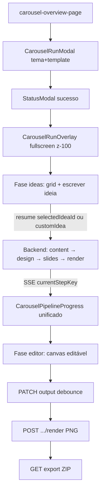

# Carousel Editor Overlay — Design Spec

**Data:** 2026-07-03  
**Status:** Aprovado para implementação  
**Agent ID:** `carousel`  
**Plano de execução:** [`docs/superpowers/plans/2026-07-03-carousel-editor-overlay-execution-loop.md`](../plans/2026-07-03-carousel-editor-overlay-execution-loop.md)  
**Spec anterior (baseline):** [`2026-06-28-carousel-agent-design.md`](./2026-06-28-carousel-agent-design.md)

---

## Resumo executivo

Simplificar o fluxo do agente Carrossel de **4 fases de wizard** (ideia → conteúdo → design → preview) para **2 fases em overlay fullscreen**:

1. **Ideias** — selecionar card ou escrever ideia customizada  
2. **Editor** — slides já gerados; edição visual + ajustes assistidos

O backend continua gerando conteúdo e plano de design automaticamente (sem pausas humanas). O usuário edita o resultado final no editor visual sobre o HTML/CSS existente.

**Decisão de produto confirmada:** imagens obrigatórias entram com **placeholder visual** no HTML; o usuário troca no editor via upload por slot.

---

## Problema atual

| Fricção | Local |
|---------|-------|
| Wizard 4 fases dentro de `PageLayout` com sidebar visível | `carousel-run-detail-page.tsx` |
| Revisão escrita de conteúdo e plano de design | `carousel-content-step.tsx`, `carousel-design-plan-step.tsx` |
| Preview passivo (`pointer-events-none`) | `CarouselSlideRenderer` |
| Sem ideia customizada (só grid de cards) | `carousel-ideas-step.tsx` |
| Stepper de 4 pills desalinhado com novo fluxo | `carousel-run-stepper.tsx` |

---

## Fluxo alvo



### O que permanece inalterado

- Overview (`/dashboard/agents/carousel`) — `PageLayout` + lista de runs  
- Modal de início (`carousel-run-modal.tsx`) — tema, template, redes  
- `StatusModal` após iniciar run — botão "Ver execução"  
- Permissão `generation.create` — sem chave nova  
- Templates HTML/CSS em disco + pipeline LLM existente  
- Export ZIP via `GET /api/agents/carousel/runs/:runId/export`

---

## Fases UI — de 4 para 2

### Antes

```typescript
type CarouselRunStepId = "ideas" | "content" | "design" | "preview";
```

### Depois

```typescript
type CarouselOverlayPhase = "ideas" | "editor";
```

| Fase UI | Condição de entrada | Componente |
|---------|---------------------|------------|
| `ideas` | `currentStepKey === "await_idea_selection"` ou fase idle pós-`generate_ideas` | Evoluir `CarouselIdeasStep` + card "Escrever minha ideia" |
| `editor` | `generate_slides` concluído **ou** run `COMPLETED` | Evoluir `CarouselPreviewDialog` → `CarouselEditorShell` |

### Loading entre ideias e editor

Unificar sub-steps de `generate_content`, `generate_design_plan`, `generate_slides`, `render_slides` em `CarouselPipelineProgress`:

```
✓ Gerando conteúdo
● Montando layout        ← currentStepKey
○ Finalizando slides
○ Preparando imagens
```

Reaproveitar `SubStepRow` de `carousel-step-states.tsx` com nova config que mapeia todos os backend steps pós-ideia.

---

## Arquitetura UI

### Overlay host

Montar em `dashboard-shell.tsx` ao lado de `CarouselRunModalProvider`:

```tsx
const isCarouselRun = matchAgentRunPath(pathname, "carousel");
return (
  <>
    <AppShell>{children}</AppShell>
    <CarouselRunModalProvider />
    {isCarouselRun ? (
      <CarouselRunOverlay runId={runId} data-testid="carousel-run-overlay" />
    ) : null}
  </>
);
```

- Portal: `createPortal(document.body)`  
- Classes: `fixed inset-0 z-[100] bg-[var(--bg-base)]`  
- `body { overflow: hidden }` enquanto aberto  
- `role="dialog"` + `aria-modal="true"` + focus trap  
- `carousel-run-detail-page.tsx` retorna `null` no shell — overlay é a UI real  
- Deep link `/dashboard/agents/carousel/runs/:runId` continua funcionando

### Layout do editor (desktop)

Referência anatômica: `cut-preview-dialog.tsx` (canvas central + painel lateral).

```
┌─ Header: ← Voltar | Slide 2/5 | Instagram pill | Salvar | Exportar ─┐
├ filmstrip ├──────── canvas (4:5) ────────├── painel propriedades ──────┤
│  vertical │                             │  Textarea / posição / zoom  │
│  72px     │                             │  Upload imagem (slot)       │
├───────────┴─────────────────────────────┴─────────────────────────────┤
│ [Sparkles] Deixar mais direto · Encurtar · … · [input ajuste…] [→]   │
└───────────────────────────────────────────────────────────────────────┘
```

**Mobile:** abas `Slide` | `Ajustes` | filmstrip horizontal (padrão cortes).

### Componentes — evoluir vs criar

| Ação | Arquivo |
|------|---------|
| Evoluir | `carousel-preview-dialog.tsx` → extrair `CarouselSlideStage` compartilhado |
| Evoluir | `carousel-ideas-step.tsx` → `customIdea` |
| Evoluir | `carousel-step-states.tsx` → pipeline unificado |
| Evoluir | `carousel-run-steps.ts` → 2 fases |
| Evoluir | `use-carousel-run-detail.ts` → remover actions content/design |
| Evoluir | `dashboard-shell.tsx` → overlay host |
| Criar | `editor/carousel-run-overlay.tsx` |
| Criar | `editor/carousel-editor-shell.tsx` |
| Criar | `editor/carousel-editor-canvas.tsx` |
| Criar | `editor/carousel-editor-layers-panel.tsx` |
| Criar | `editor/carousel-editor-adjust-bar.tsx` |
| Criar | `editor/carousel-pipeline-progress.tsx` |
| Criar | `stores/carousel-editor-store.ts` |
| Criar | `hooks/use-carousel-ai-edit.ts`, `hooks/use-carousel-render.ts` |
| Deprecar (Fase 1+) | `carousel-content-step.tsx`, `carousel-design-plan-step.tsx`, `carousel-run-stepper.tsx` |

### Ativos reutilizáveis

| Ativo | Arquivo | Uso no editor |
|-------|---------|---------------|
| Render 1080×1350 | `carousel-slide-renderer.tsx` | `buildCarouselSlideSrcDoc`, `computeCarouselPreviewFrameSize` |
| Preview imersivo | `carousel-preview-dialog.tsx` | Nav ←/→, filmstrip, swipe, `ShortcutHint` |
| Ideias | `carousel-ideas-step.tsx` | Cards `SurfaceIcon`, borda accent |
| Loading | `carousel-step-states.tsx` | `SubStepRow` para pipeline automático |
| Upload | `use-carousel-image-upload.ts` | Slots `slideId:slotKey` no painel do editor |
| Persistência | `useEditAgentRunOutput` | `PATCH /agents/runs/:runId/output` |
| Export | `carousel-preview-step.tsx` | Botão no header do overlay |

---

## Canvas editável

**Por quê iframe + react-moveable (não Fabric/Polotno):** 76+ templates já geram `htmlContent` + `cssContent`. O pipeline em `generate-slides.step.ts` + `slide-template-engine.ts` é a fonte de verdade.

### Dependências novas (só `apps/web`)

- `react-moveable` — drag, resize, scale  
- `selecto` (opcional v1) — multi-select

### Implementação

1. `CarouselEditorCanvas` — iframe `srcDoc` via `buildCarouselSlideSrcDoc` (same-origin)  
2. On load: injetar `data-carousel-layer-id` nos elementos editáveis (heurística: `h1–h3, p, .badge-pill, img, [class*="__bg"]`)  
3. Parent attach `Moveable` ao elemento selecionado no `contentDocument`  
4. Serializar: `body.innerHTML` + estilos inline → atualizar `CarouselOutputSlide` no store  
5. Zoom de imagem: slider `transform: scale()` no painel (não no Moveable)  
6. Robustez incremental: `data-carousel-layer="title|body|image|bg"` nos templates `content-machine` e `minimal-clean` primeiro

### Estado

```typescript
// carousel-editor-store.ts — só UI/editor local (Zustand)
{ slides, activeSlideId, selectedLayerId, dirty, panelTab }

// Server truth — useAgentRun + useEditAgentRunOutput (já existem)
```

Não duplicar runs no Zustand global `blister-os-store`.

### Performance

- Só 1 slide renderizado no canvas ativo  
- Filmstrip usa thumbs PNG ou width fixo 72px  
- Debounce save ≥ 1500ms; não chama render PNG a cada drag

---

## Identidade visual Blister

### Tokens (nunca cores raw, nunca `dark:`)

| Uso | Token |
|-----|-------|
| Fundo fullscreen | `--bg-base` |
| Header / painéis | `--bg-base` + `border-[var(--line-default)]` |
| Área do slide (chrome) | `--bg-canvas` |
| Inputs / código | `--bg-sunken` |
| Hover botões nav | `--bg-hover` |
| Seleção ativa | `border-[var(--accent)]` + `bg-[color-mix(in_oklch,var(--accent)_8%,transparent)]` |
| Título overlay | `Heading level="h4"` |
| Labels de campo | `text-[10.5px] font-semibold uppercase tracking-wide text-[var(--fg-tertiary)]` |
| Accent de marca no template | `#563BE7` (`accentColor` default) — separado do `--accent` laranja do DS |

### Tipografia e ícones

- Fonte UI: **Satoshi** (`globals.css`)  
- Ícones: `lucide-react`, `size-4`; agente usa `GalleryHorizontal`  
- `SurfaceIcon` nos cards de ideia  
- Animações: `framer-motion` + `tw-animate-css` na entrada (`animate-in fade-in`)

### Linguagem de produto (PT-BR, zero jargão IA)

| Usar | Evitar |
|------|--------|
| Ajustar, Editar, Exportar, Salvar, Escolher ideia | Agente, prompt, LLM, IA |
| Barra de ajustes com ícone `Sparkles` | "Gerar com IA", "Assistente" |
| "Processando seu carrossel…" | "O agente está pensando" |
| "Deixar mais direto", "Encurtar texto", "Mais contraste" | Nomes técnicos de steps |

Namespace i18n: `carousel.editor.*` em `apps/web/messages/pt-BR.json`.

---

## Backend — pipeline simplificado

### Steps

| Step | Ação |
|------|------|
| `generate_ideas` | Mantém |
| `await_idea_selection` | Mantém — **única pausa humana** |
| `generate_content` | Mantém (automático pós-ideia) |
| `await_content_approval` | **Remove** |
| `generate_design_plan` | Mantém (automático) |
| `await_design_approval` | **Remove** |
| `generate_slides` | Mantém + placeholder de imagem |
| `render_slides` | Mantém |
| `finalize_carousel` | Mantém |

### Cadeia pós-remoção das pausas

```
await_idea_selection → generate_content → generate_design_plan → generate_slides → render_slides → finalize_carousel
```

Arquivos a ajustar:

- `agent.ts` — remover steps e routing de content/design approval  
- `slides-generation-context.ts` — ler `generate_design_plan` direto  
- `render-slides.step.ts` — idem  
- `workflow-engine.service.ts` — simplificar `resolveCarouselResumeFromStep`  
- `design-plan.prompts.ts`, `slide-count-alignment.util.ts` — não referenciar `await_*_approval`

### Placeholder de imagem

Em `generate-slides.step.ts`: quando `imageUrls[slot]` ausente, injetar gradient SVG data-URI usando `accentColor` do brand context.

### Ideia customizada

Estender schema em `packages/types/src/agents/carousel.ts`:

```typescript
export const carouselCustomIdeaSchema = z.object({
  title: z.string().min(1),
  description: z.string().optional(),
});

export const carouselIdeaSelectionSchema = z
  .object({
    selectedIdeaId: z.string().optional(),
    customIdea: carouselCustomIdeaSchema.optional(),
  })
  .refine((data) => Boolean(data.selectedIdeaId || data.customIdea), {
    message: "Select an idea or provide a custom idea",
  });
```

UI: card dashed `border-dashed` "Escrever minha ideia" → expande `Textarea` no mesmo grid dos cards.

`generate-ideas.step.ts` / `generate-content.step.ts` devem aceitar `customIdea` como fonte quando `selectedIdeaId` ausente.

---

## Contratos de API

### Existentes (reutilizar)

| Method | Path | Uso no editor |
|--------|------|---------------|
| `POST` | `/api/agents/carousel/run` | Iniciar run |
| `GET` | `/api/agents/carousel/runs/:runId` | Poll + SSE |
| `POST` | `/api/agents/carousel/runs/:runId/resume` | Selecionar ideia / customIdea |
| `PATCH` | `/api/agents/runs/:runId/output` | Salvar slides editados (debounce 1.5s) |
| `GET` | `/api/agents/carousel/runs/:runId/export` | Export ZIP |

### Novos

#### `POST /api/agents/carousel/runs/:runId/render`

Re-renderiza PNGs após edição manual. Reusa `CarouselRenderService` (Puppeteer → S3).

**Request:**

```typescript
{
  slideIds?: string[]; // omit = all slides
}
```

**Response:**

```typescript
{
  slides: CarouselOutputSlide[]; // com pngFileId atualizado
}
```

**Permission:** `generation.create`  
**Validação:** `assertRunBelongsToWorkspace(runId, workspaceId)`

#### `POST /api/agents/carousel/runs/:runId/ai-edit`

Ajuste assistido sobre HTML/CSS de um slide.

**Request:**

```typescript
{
  slideId: string;
  mode: "rewrite_text" | "visual_edit";
  prompt: string;
  layerId?: string;
}
```

**Response:**

```typescript
{
  htmlContent: string;
  cssContent: string;
}
```

**Implementação:**

- Controller: `carousel-ai-edit.controller.ts`  
- Service: `carousel-ai-edit.service.ts` em `apps/api/src/agents/carousel/`  
- LLM: `sdk.ia.llm` via `@company-os/agent-ia-sdk` apenas  
- Créditos: débito por chamada (padrão agente)

---

## Segurança

| Risco | Mitigação |
|-------|-----------|
| XSS no slide editado | iframe `srcDoc` isolado do parent |
| `ai-edit` cross-tenant | `assertRunBelongsToWorkspace` |
| URL arbitrária no HTML | Upload via presigned existente (`useCarouselImageUpload`) |
| Scripts no parent | Não injetar `htmlContent` direto no DOM da app |

---

## Runs legados

Runs pausados em `await_content_approval` ou `await_design_approval`:

- Banner no overlay: "Esta execução usa o fluxo anterior"  
- Botão "Continuar" que auto-resume com defaults (`contentApproved: true`, `designApproved: true`, uploads vazios)  
- Documentar em `docs/agents/carousel/README.md`

---

## Fora de escopo

- Editor de templates no produto  
- `aiGeneratedImages` (toggle "Em breve" em settings)  
- Canvas rebuild / Polotno / Fabric  
- Agentes `planning` / `script`  
- Integração com `markdown-editor.tsx`

---

## Critérios de aceite

1. Tema → ideias (card ou custom) → slides **sem** UI de conteúdo/design escrito  
2. Overlay cobre sidebar + header (`data-testid="carousel-run-overlay"`, `z-[100]`, body scroll lock)  
3. Visual alinhado ao preview dialog + idea cards + `SubStepRow`  
4. Edição manual: texto, posição, zoom imagem, upload slot  
5. Salvar (`PATCH output`) + export ZIP funcionam após edição  
6. Barra de ajustes com chips + Sparkles — copy operacional PT-BR  
7. `pnpm test` + e2e `carousel-flow.spec.ts` verdes na raiz

---

## Mapa de implementação (T0–T17)

| ID | Entrega | Teste TDD sugerido |
|----|---------|-------------------|
| T0 | Esta spec | N/A |
| T1 | `customIdea` schema + testes | `carousel.test.ts` |
| T2 | Remover `await_*_approval` | `agent.spec.ts` |
| T3 | Steps leem outputs direto | `generate-slides.step.spec.ts` |
| T4 | Placeholder de imagem | `generate-slides.step.spec.ts` |
| T5 | `carousel-run-steps.ts` → 2 fases | `carousel-run-display.test.ts` |
| T6 | `CarouselPipelineProgress` | vitest mapper sub-steps |
| T7 | `CarouselRunOverlay` portal | vitest + e2e overlay |
| T8 | `CarouselIdeasStep` + custom | vitest + e2e |
| T9 | `CarouselEditorShell` read-only | vitest + e2e |
| T10 | Remover content/design da page | e2e |
| T11 | store + canvas + moveable | vitest serialize |
| T12 | layers panel + upload | vitest + e2e |
| T13 | PATCH debounce + POST render | api test + vitest |
| T14 | POST ai-edit backend | `carousel-ai-edit.service.spec.ts` |
| T15 | AdjustBar + `useCarouselAiEdit` | vitest + e2e |
| T16 | `data-carousel-layer` templates | validate script |
| T17 | Polish: atalhos, legados, deprecar | e2e completo |

---

## Riscos

| Risco | Mitigação |
|-------|-----------|
| CSS do slide vaza para app | iframe isolado |
| Preview dialog vs fullscreen | Extrair `CarouselSlideStage`; não duplicar nav/frame |
| Runs legados | Banner + auto-resume |
| Identidade inconsistente | Checklist tokens + Heading/Paragraph |
| 15 slides performance | Só slide ativo no canvas; thumbs PNG cache |

---

## Wireframes ASCII

### Fase ideas (overlay)

```
┌──────────────────────────────────────────────────────────────────────┐
│ ← Voltar ao Carrossel          Escolha uma ideia          Slide 1/5  │
├──────────────────────────────────────────────────────────────────────┤
│                                                                      │
│   ┌─────────────┐  ┌─────────────┐  ┌─────────────┐               │
│   │ [icon]      │  │ [icon]      │  │ [icon]      │               │
│   │ Ideia A     │  │ Ideia B     │  │ Ideia C     │               │
│   │ descrição…  │  │ descrição…  │  │ descrição…  │               │
│   └─────────────┘  └─────────────┘  └─────────────┘               │
│                                                                      │
│   ┌ ─ ─ ─ ─ ─ ─ ─ ─ ─ ─ ─ ─ ─ ─ ─ ─ ─ ─ ─ ─ ─ ─ ─ ─ ─ ─ ┐         │
│   │  + Escrever minha ideia                                │         │
│   └ ─ ─ ─ ─ ─ ─ ─ ─ ─ ─ ─ ─ ─ ─ ─ ─ ─ ─ ─ ─ ─ ─ ─ ─ ─ ─ ┘         │
│                                                                      │
│                              [ Continuar ]                           │
└──────────────────────────────────────────────────────────────────────┘
```

### Fase editor (overlay)

```
┌──────────────────────────────────────────────────────────────────────┐
│ ←  Slide 2/5  [Instagram]                    [Salvar] [Exportar ZIP] │
├────┬──────────────────────────────────────────────┬──────────────────┤
│ ▢1 │                                              │ Título           │
│ ▢2 │         ┌────────────────────┐             │ [textarea]       │
│ ▢3 │         │                    │             │                  │
│ ▢4 │         │   slide canvas     │             │ Posição X/Y      │
│ ▢5 │         │   (iframe 4:5)     │             │ Zoom imagem      │
│    │         └────────────────────┘             │ [Upload slot]    │
├────┴──────────────────────────────────────────────┴──────────────────┤
│ ✦ Deixar mais direto · Encurtar · Mais contraste  [________] [→]    │
└──────────────────────────────────────────────────────────────────────┘
```

### Pipeline loading (entre fases)

```
┌──────────────────────────────────────────────────────────────────────┐
│ Processando seu carrossel…                                           │
│                                                                      │
│   ✓ Gerando conteúdo                                                 │
│   ● Montando layout                                                  │
│   ○ Finalizando slides                                               │
│   ○ Preparando imagens                                               │
└──────────────────────────────────────────────────────────────────────┘
```

---

*Spec gerada para execução via loop TDD em `2026-07-03-carousel-editor-overlay-execution-loop.md`.*
